# Auth Controller Flow Diagrams

## 1. Login Flow

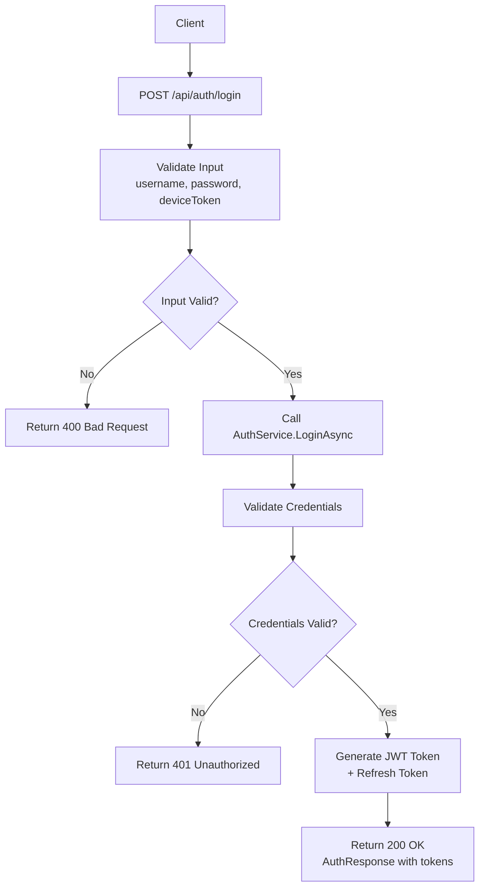

## 2. Register Flow

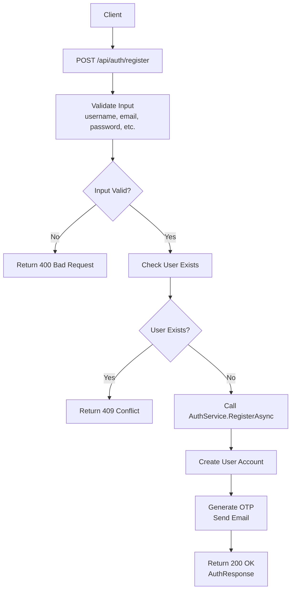

## 3. Verify Email Flow

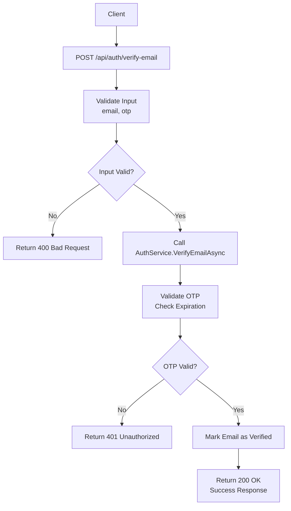

## 4. Refresh Token Flow

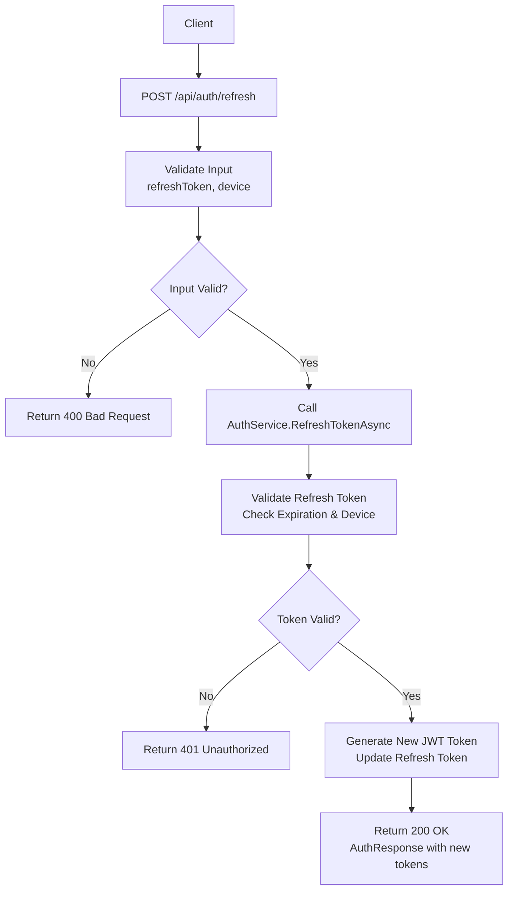

## 5. Logout Flow

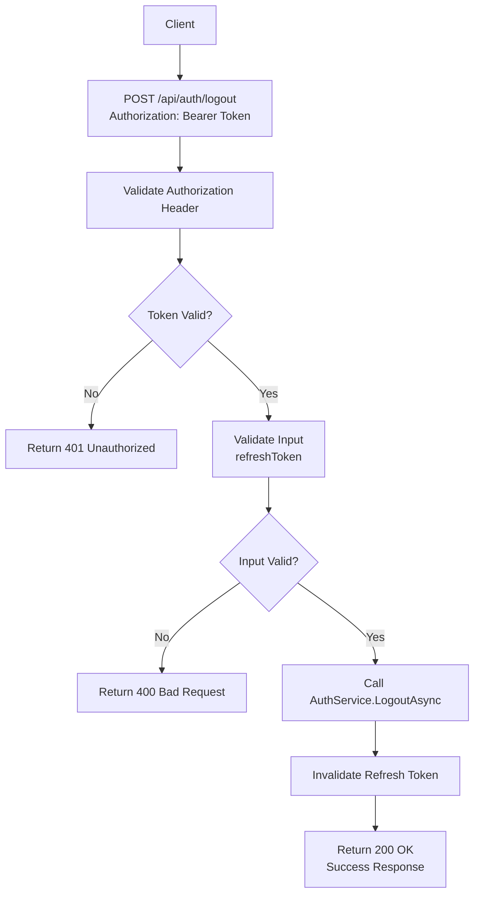

## 6. Request Password Reset Flow

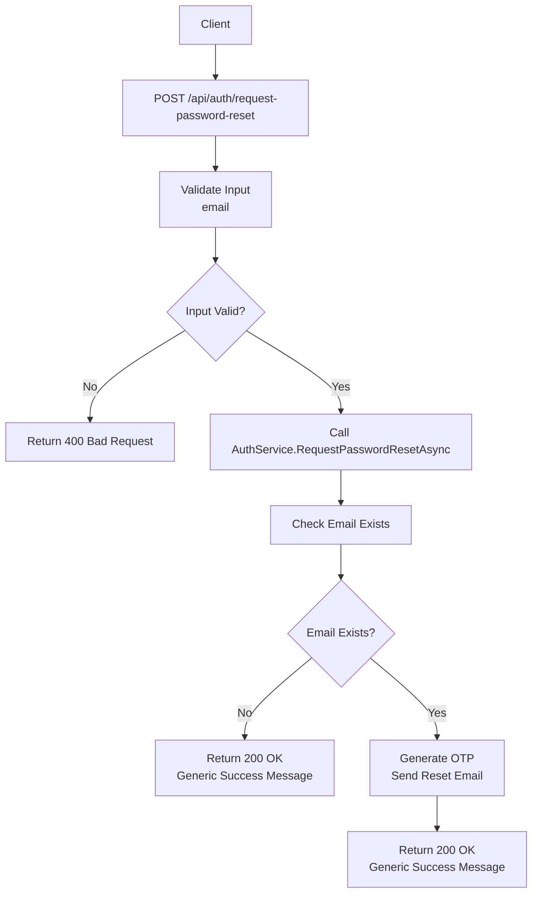

## 7. Reset Password Flow

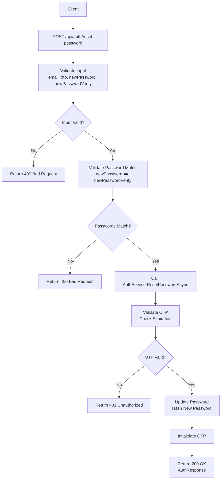

## 2. Admin Controller Flow Diagrams

### 2.1 CRUD Operations Flow (Generic)
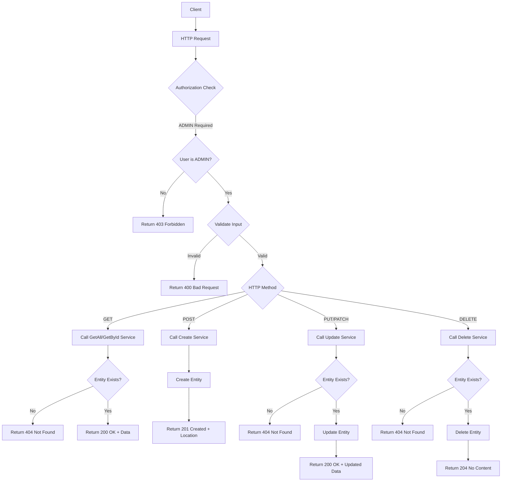

### 2.2 Admin Dashboard Aggregation Flow
```mermaid
flowchart TD
    A[Client] --> B[GET /api/admin/{entity}]
    B --> C[Authorize ADMIN]
    C --> D{Entity Type}
    D -->|bookings| E[Call BookingService.GetAllAsync]
    D -->|categories| F[Call CategoryService.GetAllAsync]
    D -->|orders| G[Call OrderService.GetAllAsync]
    D -->|roles| H[Call RoleService.GetAllAsync]
    D -->|payments| I[Call PaymentService.GetAllAsync]
    D -->|staff-schedules| J[Call StaffScheduleService.GetAllAsync]
    E --> K[Aggregate Results]
    F --> K
    G --> K
    H --> K
    I --> K
    J --> K
    K --> L[Return 200 OK + Data]
```

## 3. Booking Controller Flow Diagrams

### 3.1 Standard CRUD Operations
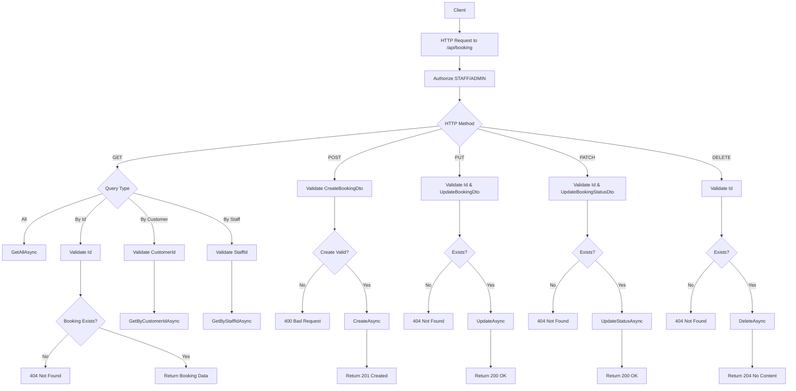

### 3.2 Availability Check Flow
```mermaid
flowchart TD
    A[Client] --> B[GET /api/booking/check-staff-available]
    B --> C[Authorize STAFF/ADMIN]
    C --> D[Extract Query Params: staffId, startTime, endTime]
    D --> E{Params Valid?}
    E -->|No| F[400 Bad Request]
    E -->|Yes| G[Call IsStaffAvailableAsync]
    G --> H{Check Database for Conflicts}
    H --> I[Return boolean availability]
    I --> J[Return 200 OK + {available: true/false}]

    K[Client] --> L[GET /api/booking/check-room-available]
    L --> M[Authorize STAFF/ADMIN]
    M --> N[Extract Query Params: roomId, startTime, endTime]
    N --> O{Params Valid?}
    O -->|No| P[400 Bad Request]
    O -->|Yes| Q[Call IsRoomAvailableAsync]
    Q --> R{Check Database for Conflicts}
    R --> S[Return boolean availability]
    S --> T[Return 200 OK + {available: true/false}]
```

## 4. Payment Controller Flow Diagrams

### 4.1 Payment CRUD Operations
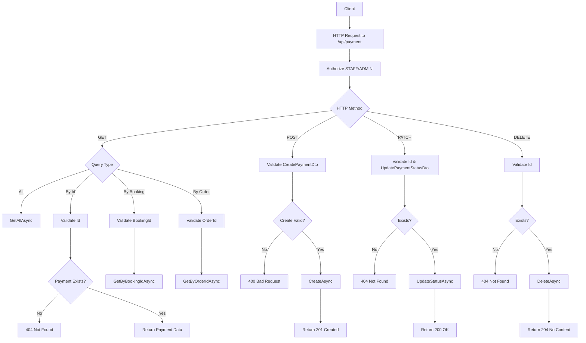

## 5. Product Controller Flow Diagrams

### 5.1 Product Management Flow
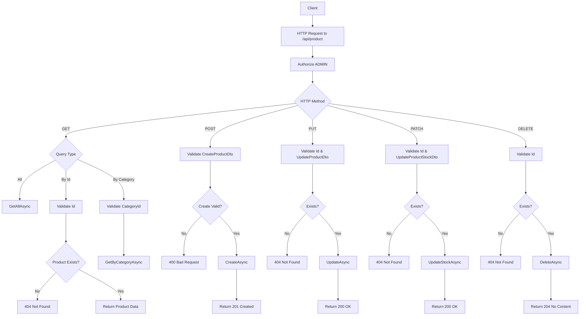

## 6. VNPay Controller Flow Diagrams

### 6.1 VNPay Booking Payment Flow
```mermaid
flowchart TD
    A[Client] --> B[POST /api/vnpay/booking]
    B --> C[Authorize User]
    C --> D[Validate CreateVnPayBookingPaymentDto]
    D --> E{Valid?}
    E -->|No| F[400 Bad Request]
    E -->|Yes| G[Get Booking by Id]
    G --> H{Booking Exists?}
    H -->|No| I[404 Not Found]
    H -->|Yes| J{Booking has TotalAmount?}
    J -->|No| K[400 Bad Request - No amount]
    J -->|Yes| L[Create Payment Record - Status: Pending]
    L --> M[Create VnPayRequestDto]
    M --> N[Generate Payment URL]
    N --> O[Return 200 OK + {paymentUrl, paymentId}]
```

### 6.2 VNPay Order Payment Flow
```mermaid
flowchart TD
    A[Client] --> B[POST /api/vnpay/order]
    B --> C[Authorize User]
    C --> D[Validate CreateVnPayOrderPaymentDto]
    D --> E{Valid?}
    E -->|No| F[400 Bad Request]
    E -->|Yes| G[Get Order by Id]
    G --> H{Order Exists?}
    H -->|No| I[404 Not Found]
    H -->|Yes| J{Order has TotalAmount?}
    J -->|No| K[400 Bad Request - No amount]
    J -->|Yes| L[Create Payment Record - Status: Pending]
    L --> M[Create VnPayRequestDto]
    M --> N[Generate Payment URL]
    N --> O[Return 200 OK + {paymentUrl, paymentId}]
```

### 6.3 VNPay IPN (Server-to-Server) Callback Flow
```mermaid
flowchart TD
    A[VNPay Server] --> B[GET /api/vnpay/ipn]
    B --> C[Allow Anonymous]
    C --> D[Extract Query Parameters]
    D --> E[Process VNPay Callback]
    E --> F{Verify Signature & Parse Response}
    F -->|Invalid| G[Return 200 OK + {RspCode: 99, Message: Error}]
    F -->|Valid| H{Is Success?}
    H -->|No| I[Log Warning]
    I --> J[Return 200 OK + {RspCode: 99, Message: Failed}]
    H -->|Yes| K[Parse OrderId: TYPE_ENTITYID_PAYMENTID]
    K --> L{Valid Format?}
    L -->|No| M[Log Warning]
    M --> N[Return 200 OK + {RspCode: 99, Message: Invalid OrderId}]
    L -->|Yes| O[Update Payment Status to Completed]
    O --> P{Is Booking Payment?}
    P -->|Yes| Q[Update Booking Status to Confirmed]
    P -->|No| R[Skip Booking Update]
    Q --> S[Log Success]
    R --> S
    S --> T[Return 200 OK + {RspCode: 00, Message: Success}]
```

### 6.4 VNPay Return (User Redirect) Flow
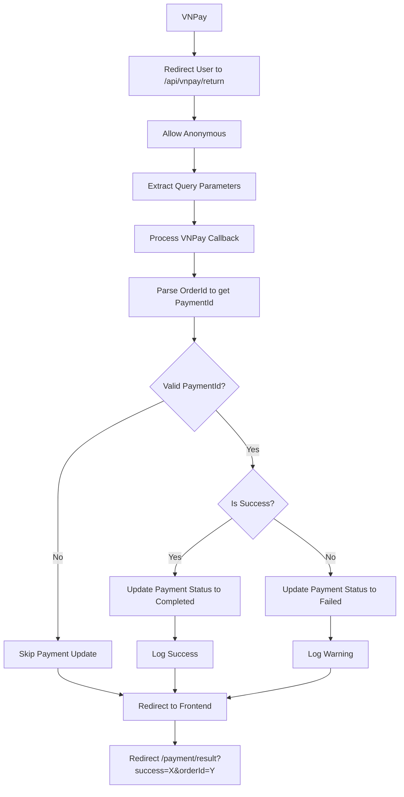

## 7. Other Controllers Overview

### 7.1 BaseApiController Common Response Methods
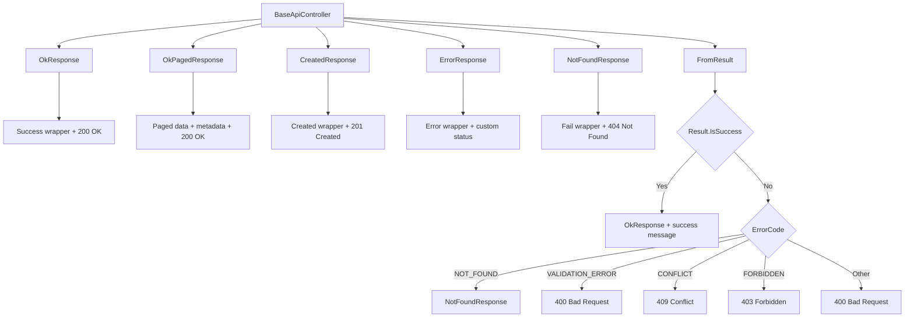

### 7.2 BookingServiceController Flow
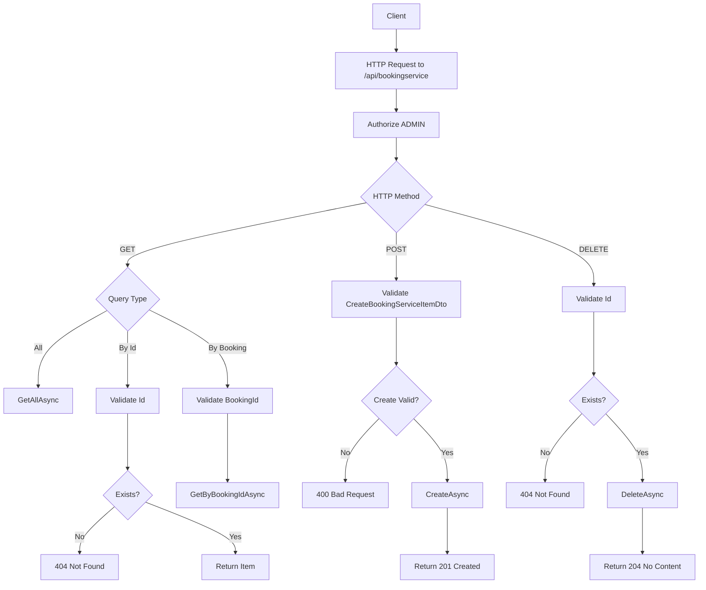

### 7.3 OrderController Flow
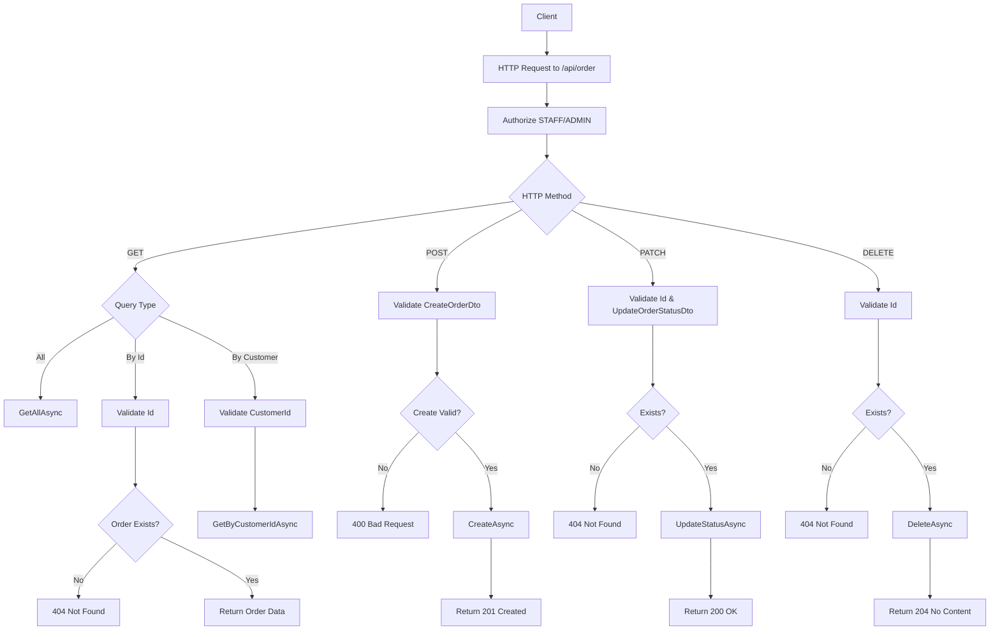

### 7.4 OrderItemController Flow
```mermaid
flowchart TD
    A[Client] --> B[HTTP Request to /api/orderitem]
    B --> C[Authorize ADMIN]
    C --> D{HTTP Method}
    D -->|GET| E{Query Type}
    E -->|All| F[GetAllAsync]
    E -->|By Id| G[Validate Id]
    E -->|By Order| H[Validate OrderId]
    G --> I{OrderItem Exists?}
    I -->|No| J[404 Not Found]
    I -->|Yes| K[Return Item Data]
    H --> L[GetByOrderIdAsync]
    D -->|POST| M[Validate CreateOrderItemDto]
    M --> N{Create Valid?}
    N -->|No| O[400 Bad Request]
    N -->|Yes| P[CreateAsync]
    P --> Q[Return 201 Created]
    D -->|PUT| R[Validate Id & UpdateOrderItemDto]
    R --> S{Exists?}
    S -->|No| T[404 Not Found]
    S -->|Yes| U[UpdateAsync]
    U --> V[Return 200 OK]
    D -->|DELETE| W[Validate Id]
    W --> X{Exists?}
    X -->|No| Y[404 Not Found]
    X -->|Yes| Z[DeleteAsync]
    Z --> AA[Return 204 No Content]
```

### 7.5 PersonController Flow (Advanced)
```mermaid
flowchart TD
    A[Client] --> B[HTTP Request to /api/person]
    B --> C[Authorize ADMIN]
    C --> D{HTTP Method}
    D -->|GET| E{Query Type}
    E -->|All| F[GetAllAsync]
    E -->|Search| G[Build PersonSearchRequest]
    E -->|By Id| H[Validate Id]
    E -->|Detail| I[Validate Id]
    E -->|By Role| J[Validate RoleId]
    H --> K{Exists?}
    K -->|No| L[404 Not Found]
    K -->|Yes| M[Return Person Data]
    I --> N{Exists?}
    N -->|No| O[404 Not Found]
    N -->|Yes| P[GetDetailByIdAsync]
    P --> Q[Return PersonDetailDto]
    J --> R[GetByRoleAsync]
    G --> S[SearchAsync with filters]
    S --> T[Return PersonSearchResponse]
    D -->|POST| U[Validate CreatePersonDto]
    U --> V{Create Valid?}
    V -->|No| W[400 Bad Request]
    V -->|Yes| X[CreateAsync]
    X --> Y[Return 201 Created]
    D -->|PUT| Z[Validate Id & UpdatePersonDto]
    Z --> AA{Exists?}
    AA -->|No| BB[404 Not Found]
    AA -->|Yes| CC[UpdateAsync]
    CC --> DD[Return 200 OK]
    D -->|DELETE| EE[Validate Id]
    EE --> FF{Exists?}
    FF -->|No| GG[404 Not Found]
    FF -->|Yes| HH[DeleteAsync]
    HH --> II[Return 204 No Content]
```

### 7.6 RoleController Flow
```mermaid
flowchart TD
    A[Client] --> B[HTTP Request to /api/role]
    B --> C[Authorize ADMIN]
    C --> D{HTTP Method}
    D -->|GET| E{Query Type}
    E -->|All| F[GetAllAsync]
    E -->|By Id| G[Validate Id]
    G --> H{Role Exists?}
    H -->|No| I[404 Not Found]
    H -->|Yes| J[Return Role Data]
    D -->|POST| K[Validate CreateRoleDto]
    K --> L{Create Valid?}
    L -->|No| M[400 Bad Request]
    L -->|Yes| N[CreateAsync]
    N --> O[Return 201 Created]
    D -->|PUT| P[Validate Id & UpdateRoleDto]
    P --> Q{Exists?}
    Q -->|No| R[404 Not Found]
    Q -->|Yes| S[UpdateAsync]
    S --> T[Return 200 OK]
    D -->|DELETE| U[Validate Id]
    U --> V{Exists?}
    V -->|No| W[404 Not Found]
    V -->|Yes| X[DeleteAsync]
    X --> Y[Return 204 No Content]
```

### 7.7 RoomController Flow
```mermaid
flowchart TD
    A[Client] --> B[HTTP Request to /api/room]
    B --> C[Authorize ADMIN]
    C --> D{HTTP Method}
    D -->|GET| E{Query Type}
    E -->|All| F[GetAllAsync]
    E -->|By Id| G[Validate Id]
    E -->|Availability| H[Validate Id & Dates]
    G --> I{Room Exists?}
    I -->|No| J[404 Not Found]
    I -->|Yes| K[Return Room Data]
    H --> L{Valid Params?}
    L -->|No| M[400 Bad Request]
    L -->|Yes| N[IsAvailableAsync]
    N --> O[Return availability status]
    D -->|POST| P[Validate CreateRoomDto]
    P --> Q{Create Valid?}
    Q -->|No| R[400 Bad Request]
    Q -->|Yes| S[CreateAsync]
    S --> T[Return 201 Created]
    D -->|PUT| U[Validate Id & UpdateRoomDto]
    U --> V{Exists?}
    V -->|No| W[404 Not Found]
    V -->|Yes| X[UpdateAsync]
    X --> Y[Return 200 OK]
    D -->|DELETE| Z[Validate Id]
    Z --> AA{Exists?}
    AA -->|No| BB[404 Not Found]
    AA -->|Yes| CC[DeleteAsync]
    CC --> DD[Return 204 No Content]
```

### 7.8 UploadController Flow
```mermaid
flowchart TD
    A[Client] --> B[HTTP Request to /api/upload]
    B --> C[Authorize User]
    C --> D{HTTP Method}
    D -->|POST| E[Validate IFormFile]
    E --> F{File Exists?}
    F -->|No| G[400 Bad Request - No file]
    F -->|Yes| H{Check File Size}
    H -->|>5MB| I[400 Bad Request - Too large]
    H -->|<=5MB| J{Check File Extension}
    J -->|Invalid| K[400 Bad Request - Invalid type]
    J -->|Valid (.jpg,.jpeg,.png,.gif,.webp)| L[Upload to Cloudinary]
    L --> M{Upload Success?}
    M -->|No| N[400 Bad Request - Upload failed]
    M -->|Yes| O[Return 200 OK + Image URLs]
    D -->|DELETE| P[Validate publicId]
    P --> Q{Valid publicId?}
    Q -->|No| R[400 Bad Request - Invalid ID]
    Q -->|Yes| S[Delete from Cloudinary]
    S --> T[Return 200 OK + Success status]
```

### 7.9 CRUD Controllers Pattern
```mermaid
flowchart TD
    subgraph "Standard CRUD Controllers"
        A[CategoryController] --> B[OrderController]
        B --> C[OrderItemController]
        C --> D[RoleController]
        D --> E[RoomController]
        E --> F[ServicesController]
        F --> G[StaffScheduleController]
        G --> H[PersonController]
        H --> I[BookingServiceController]
    end

    subgraph "CRUD Operations"
        J[GET /api/{entity}] --> K[GetAll]
        L[GET /api/{entity}/{id}] --> M[GetById]
        N[POST /api/{entity}] --> O[Create]
        P[PUT /api/{entity}/{id}] --> Q[Update]
        R[DELETE /api/{entity}/{id}] --> S[Delete]
    end

    subgraph "Advanced Operations"
        T[GET /api/{entity}/search] --> U[PersonController]
        V[GET /api/{entity}/{id}/detail] --> W[PersonController]
        X[GET /api/{entity}/availability] --> Y[RoomController]
        Z[PATCH /api/{entity}/{id}/status] --> AA[OrderController, PaymentController]
    end

    subgraph "Authorization Levels"
        BB[ADMIN Only] --> CC[ProductController, AdminController, PersonController]
        DD[STAFF/ADMIN] --> EE[BookingController, PaymentController, OrderController]
        FF[USER] --> GG[AuthController, VnPayController, UploadController]
        HH[Allow Anonymous] --> II[CategoryController (GET), VnPayController (IPN/Return)]
    end
```

## Authentication Flow Summary

```mermaid
flowchart TD
    subgraph Registration
        A[Register] --> B[Verify Email]
        B --> C[Login Success]
    end

    subgraph Authentication
        D[Login] --> E{Valid?}
        E -->|Yes| F[Return Tokens]
        E -->|No| G[401 Unauthorized]
    end

    subgraph Token Management
        H[Refresh Token] --> I{Valid?}
        I -->|Yes| J[New Tokens]
        I -->|No| K[401 Unauthorized]
        L[Logout] --> M[Invalidate Tokens]
    end

    subgraph Password Recovery
        N[Forgot Password] --> O[Request Reset]
        O --> P[Reset Password]
        P --> Q[Login with New Password]
    end
```

## Complete System Architecture Overview

```mermaid
flowchart TD
    subgraph "Frontend/Client"
        A[Web/Mobile App]
        A --> B[Authentication UI]
        A --> C[Admin Dashboard]
        A --> D[Booking System]
        A --> E[Payment Gateway]
        A --> F[Product Catalog]
        A --> G[File Upload]
    end

    subgraph "API Controllers Layer"
        H[AuthController] --> I[Login, Register, Refresh, Logout, Password Reset]
        J[AdminController] --> K[Aggregated Admin Endpoints]
        L[BookingController] --> M[Booking CRUD + Availability Checks]
        N[PaymentController] --> O[Payment CRUD + Status Updates]
        P[ProductController] --> Q[Product CRUD + Stock Management]
        R[VnPayController] --> S[VNPay Payment Processing]
        T[CategoryController] --> U[Category CRUD - Public GET]
        V[OrderController] --> W[Order CRUD + Status Updates]
        X[OrderItemController] --> Y[Order Items CRUD]
        Z[PersonController] --> AA[User Management + Advanced Search]
        BB[RoleController] --> CC[Role Management]
        DD[RoomController] --> EE[Room CRUD + Availability]
        FF[ServicesController] --> GG[Service CRUD]
        HH[StaffScheduleController] --> II[Staff Schedule Management]
        JJ[BookingServiceController] --> KK[Booking-Service Relations]
        LL[UploadController] --> MM[Cloudinary File Upload/Delete]
    end

    subgraph "Services Layer"
        NN[AuthService] --> OO[Authentication Logic]
        PP[BookingService] --> QQ[Booking Business Logic]
        RR[PaymentService] --> SS[Payment Processing]
        TT[ProductService] --> UU[Product Management]
        VV[VnPayService] --> WW[VNPay Integration]
        XX[CategoryService] --> YY[Category Logic]
        ZZ[OrderService] --> AAA[Order Processing]
        BBB[OrderItemService] --> CCC[Order Item Logic]
        DDD[PersonService] --> EEE[User Management]
        FFF[RoleService] --> GGG[Role Management]
        HHH[RoomService] --> III[Room Logic]
        JJJ[ServicesService] --> KKK[Service Logic]
        LLL[StaffScheduleService] --> MMM[Schedule Logic]
        NNN[BookingServiceService] --> OOO[Booking-Service Relations]
        PPP[CloudinaryService] --> QQQ[File Storage]
    end

    subgraph "Data Access Layer"
        RRR[(SQL Database)] --> SSS[Entity Framework Core]
        SSS --> TTT[Repository Pattern]
    end

    subgraph "External Services"
        UUU[VNPay Gateway] --> VVV[Payment Processing]
        WWW[Cloudinary] --> XXX[File Storage]
        YYY[Email Service] --> ZZZ[OTP & Notifications]
    end

    subgraph "Authorization Matrix"
        AAAA[Anonymous] --> BBBB[Category GET, VNPay IPN/Return]
        CCCC[User] --> DDDD[Auth, VnPay, Upload]
        EEEE[Staff/Admin] --> FFFF[Booking, Payment, Order]
        GGGG[Admin Only] --> HHHH[Product, Person, Role, Room, Services, etc.]
    end

    %% Flow connections
    A --> H
    A --> J
    A --> L
    A --> N
    A --> P
    A --> R
    A --> T
    A --> V
    A --> X
    A --> Z
    A --> BB
    A --> DD
    A --> FF
    A --> HH
    A --> JJ
    A --> LL

    H --> NN
    J --> PP
    J --> RR
    J --> TT
    J --> DDD
    J --> LLL
    J --> FFF
    L --> PP
    N --> RR
    P --> TT
    R --> VV
    R --> RR
    R --> PP
    R --> ZZ
    T --> XX
    V --> ZZ
    X --> BBB
    Z --> DDD
    BB --> FFF
    DD --> HHH
    FF --> JJJ
    HH --> LLL
    JJ --> NNN
    LL --> PPP

    NN --> RRR
    PP --> RRR
    RR --> RRR
    TT --> RRR
    VV --> UUU
    XX --> RRR
    ZZ --> RRR
    BBB --> RRR
    DDD --> RRR
    FFF --> RRR
    HHH --> RRR
    JJJ --> RRR
    LLL --> RRR
    NNN --> RRR
    PPP --> WWW

    VV --> YYY
    NN --> YYY
```

## API Endpoint Summary

| Controller | Endpoints | Authorization | Key Features |
|------------|-----------|---------------|--------------|
| **AuthController** | 7 endpoints | User/Anonymous | Login, Register, Refresh, Logout, Password Reset, Email Verification |
| **AdminController** | 25+ endpoints | Admin | Aggregated CRUD for all entities |
| **BookingController** | 9 endpoints | Staff/Admin | Booking CRUD, Status Updates, Availability Checks |
| **PaymentController** | 8 endpoints | Staff/Admin | Payment CRUD, Status Updates, Booking/Order Filtering |
| **ProductController** | 7 endpoints | Admin | Product CRUD, Stock Management, Category Filtering |
| **VnPayController** | 4 endpoints | User/Anonymous | VNPay Payment URLs, IPN, Return Callbacks |
| **CategoryController** | 5 endpoints | Anonymous/Admin | Category CRUD (GET public) |
| **OrderController** | 6 endpoints | Staff/Admin | Order CRUD, Status Updates, Customer Filtering |
| **OrderItemController** | 6 endpoints | Admin | Order Item CRUD, Order Filtering |
| **PersonController** | 9 endpoints | Admin | User CRUD, Advanced Search, Role Filtering |
| **RoleController** | 5 endpoints | Admin | Role CRUD |
| **RoomController** | 6 endpoints | Admin | Room CRUD, Availability Checks |
| **ServicesController** | 5 endpoints | Admin | Service CRUD |
| **StaffScheduleController** | 8 endpoints | Admin | Staff Schedule CRUD, Bulk Operations |
| **BookingServiceController** | 4 endpoints | Admin | Booking-Service Relationship CRUD |
| **UploadController** | 2 endpoints | User | Cloudinary Image Upload/Delete |

**Total: 16 Controllers, ~100+ API Endpoints**
