# Auth Controller Flow Diagrams

## 1. Login Flow

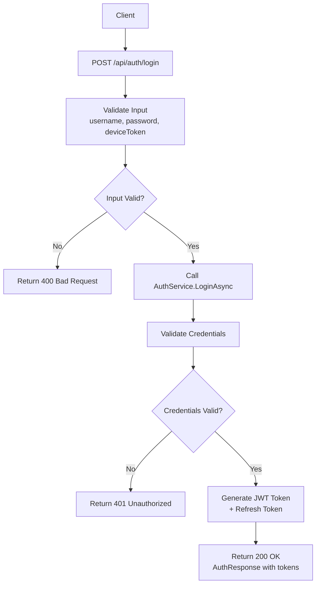

## 2. Register Flow

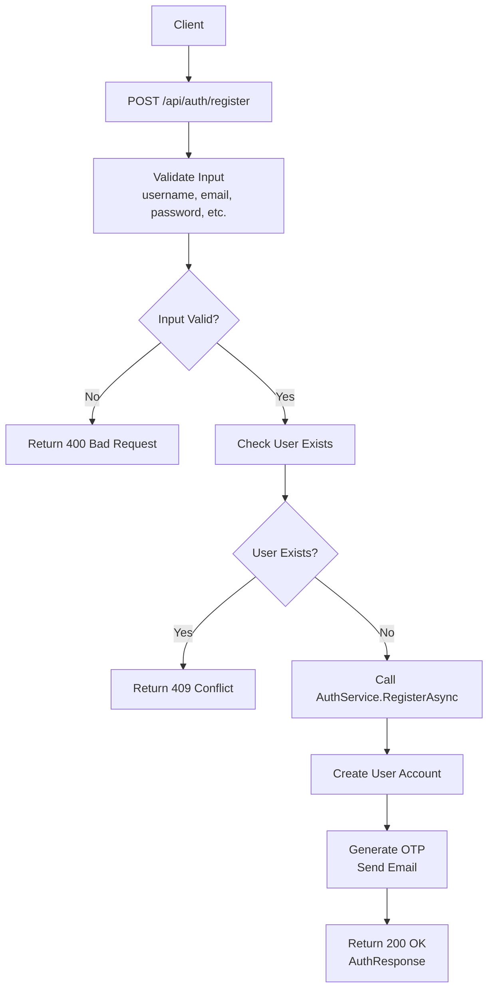

## 3. Verify Email Flow

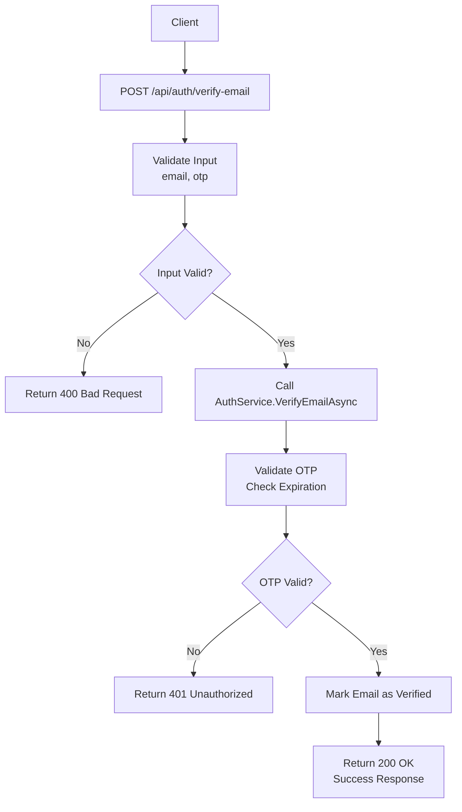

## 4. Refresh Token Flow

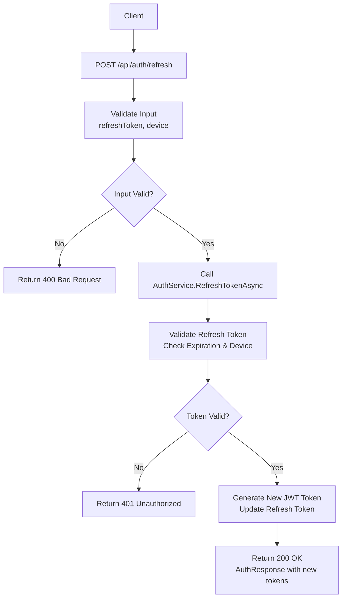

## 5. Logout Flow

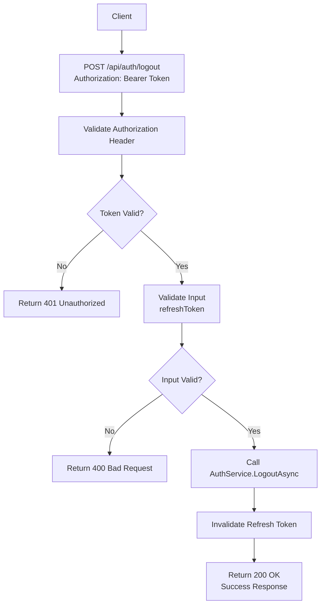

## 6. Request Password Reset Flow

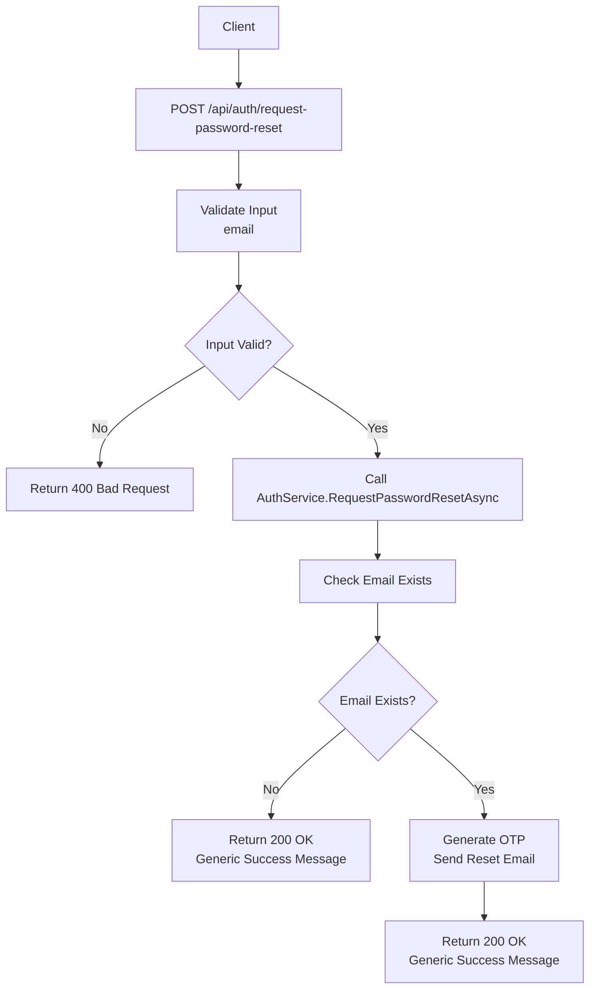

## 7. Reset Password Flow

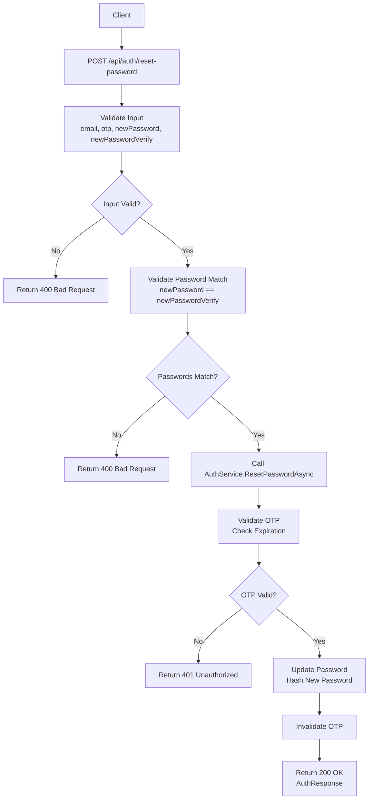

## 2. Admin Controller Flow Diagrams

### 2.1 CRUD Operations Flow (Generic)
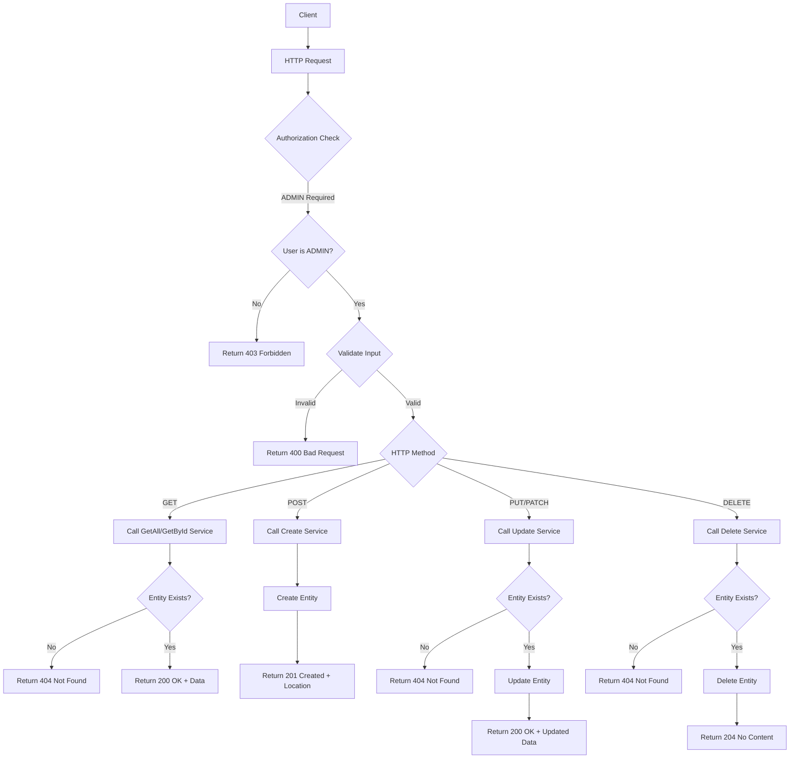

### 2.2 Admin Dashboard Aggregation Flow
```mermaid
flowchart TD
    A[Client] --> B[GET /api/admin/{entity}]
    B --> C[Authorize ADMIN]
    C --> D{Entity Type}
    D -->|bookings| E[Call BookingService.GetAllAsync]
    D -->|categories| F[Call CategoryService.GetAllAsync]
    D -->|orders| G[Call OrderService.GetAllAsync]
    D -->|roles| H[Call RoleService.GetAllAsync]
    D -->|payments| I[Call PaymentService.GetAllAsync]
    D -->|staff-schedules| J[Call StaffScheduleService.GetAllAsync]
    E --> K[Aggregate Results]
    F --> K
    G --> K
    H --> K
    I --> K
    J --> K
    K --> L[Return 200 OK + Data]
```

## 3. Booking Controller Flow Diagrams

### 3.1 Standard CRUD Operations
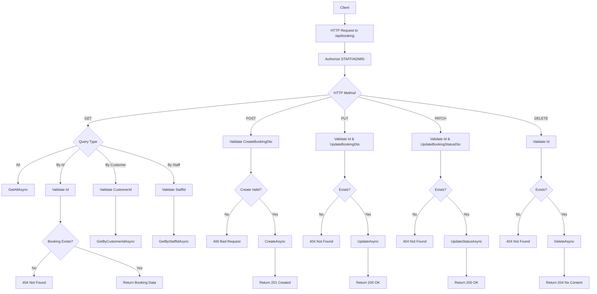

### 3.2 Availability Check Flow
```mermaid
flowchart TD
    A[Client] --> B[GET /api/booking/check-staff-available]
    B --> C[Authorize STAFF/ADMIN]
    C --> D[Extract Query Params: staffId, startTime, endTime]
    D --> E{Params Valid?}
    E -->|No| F[400 Bad Request]
    E -->|Yes| G[Call IsStaffAvailableAsync]
    G --> H{Check Database for Conflicts}
    H --> I[Return boolean availability]
    I --> J[Return 200 OK + {available: true/false}]

    K[Client] --> L[GET /api/booking/check-room-available]
    L --> M[Authorize STAFF/ADMIN]
    M --> N[Extract Query Params: roomId, startTime, endTime]
    N --> O{Params Valid?}
    O -->|No| P[400 Bad Request]
    O -->|Yes| Q[Call IsRoomAvailableAsync]
    Q --> R{Check Database for Conflicts}
    R --> S[Return boolean availability]
    S --> T[Return 200 OK + {available: true/false}]
```

## 4. Payment Controller Flow Diagrams

### 4.1 Payment CRUD Operations
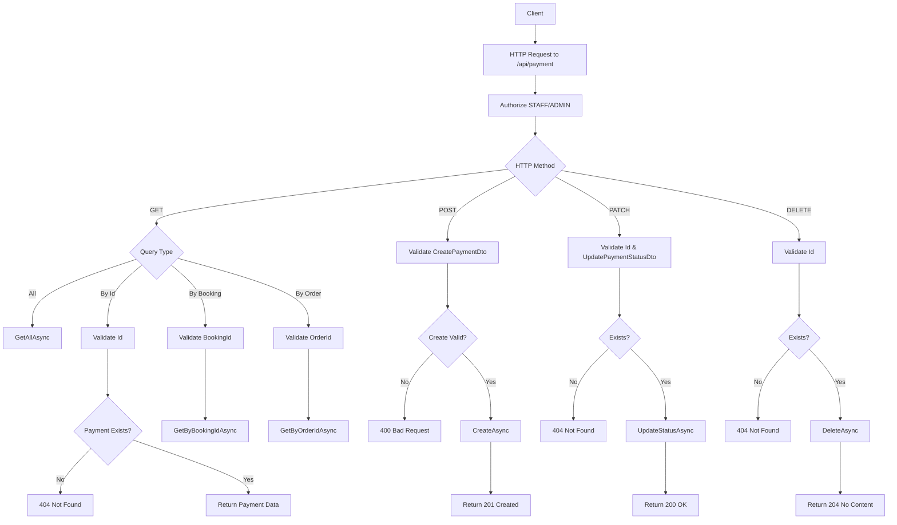

## 5. Product Controller Flow Diagrams

### 5.1 Product Management Flow
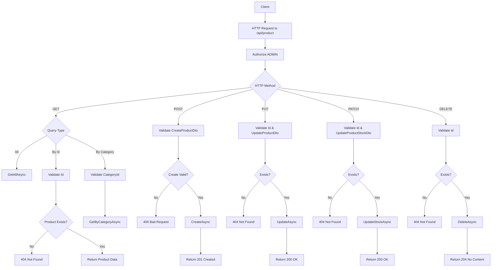

## 6. VNPay Controller Flow Diagrams

### 6.1 VNPay Booking Payment Flow
```mermaid
flowchart TD
    A[Client] --> B[POST /api/vnpay/booking]
    B --> C[Authorize User]
    C --> D[Validate CreateVnPayBookingPaymentDto]
    D --> E{Valid?}
    E -->|No| F[400 Bad Request]
    E -->|Yes| G[Get Booking by Id]
    G --> H{Booking Exists?}
    H -->|No| I[404 Not Found]
    H -->|Yes| J{Booking has TotalAmount?}
    J -->|No| K[400 Bad Request - No amount]
    J -->|Yes| L[Create Payment Record - Status: Pending]
    L --> M[Create VnPayRequestDto]
    M --> N[Generate Payment URL]
    N --> O[Return 200 OK + {paymentUrl, paymentId}]
```

### 6.2 VNPay Order Payment Flow
```mermaid
flowchart TD
    A[Client] --> B[POST /api/vnpay/order]
    B --> C[Authorize User]
    C --> D[Validate CreateVnPayOrderPaymentDto]
    D --> E{Valid?}
    E -->|No| F[400 Bad Request]
    E -->|Yes| G[Get Order by Id]
    G --> H{Order Exists?}
    H -->|No| I[404 Not Found]
    H -->|Yes| J{Order has TotalAmount?}
    J -->|No| K[400 Bad Request - No amount]
    J -->|Yes| L[Create Payment Record - Status: Pending]
    L --> M[Create VnPayRequestDto]
    M --> N[Generate Payment URL]
    N --> O[Return 200 OK + {paymentUrl, paymentId}]
```

### 6.3 VNPay IPN (Server-to-Server) Callback Flow
```mermaid
flowchart TD
    A[VNPay Server] --> B[GET /api/vnpay/ipn]
    B --> C[Allow Anonymous]
    C --> D[Extract Query Parameters]
    D --> E[Process VNPay Callback]
    E --> F{Verify Signature & Parse Response}
    F -->|Invalid| G[Return 200 OK + {RspCode: 99, Message: Error}]
    F -->|Valid| H{Is Success?}
    H -->|No| I[Log Warning]
    I --> J[Return 200 OK + {RspCode: 99, Message: Failed}]
    H -->|Yes| K[Parse OrderId: TYPE_ENTITYID_PAYMENTID]
    K --> L{Valid Format?}
    L -->|No| M[Log Warning]
    M --> N[Return 200 OK + {RspCode: 99, Message: Invalid OrderId}]
    L -->|Yes| O[Update Payment Status to Completed]
    O --> P{Is Booking Payment?}
    P -->|Yes| Q[Update Booking Status to Confirmed]
    P -->|No| R[Skip Booking Update]
    Q --> S[Log Success]
    R --> S
    S --> T[Return 200 OK + {RspCode: 00, Message: Success}]
```

### 6.4 VNPay Return (User Redirect) Flow
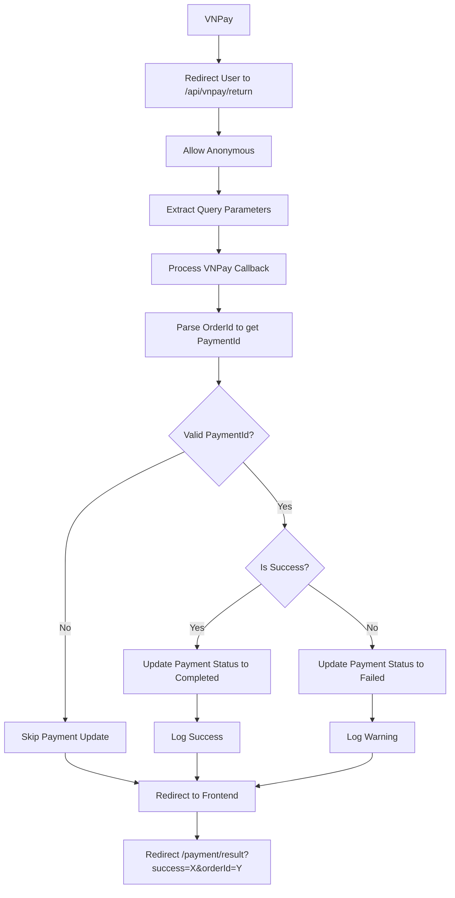

## 7. Other Controllers Overview

### 7.1 BaseApiController Common Response Methods
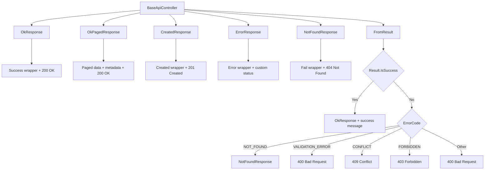

### 7.2 BookingServiceController Flow
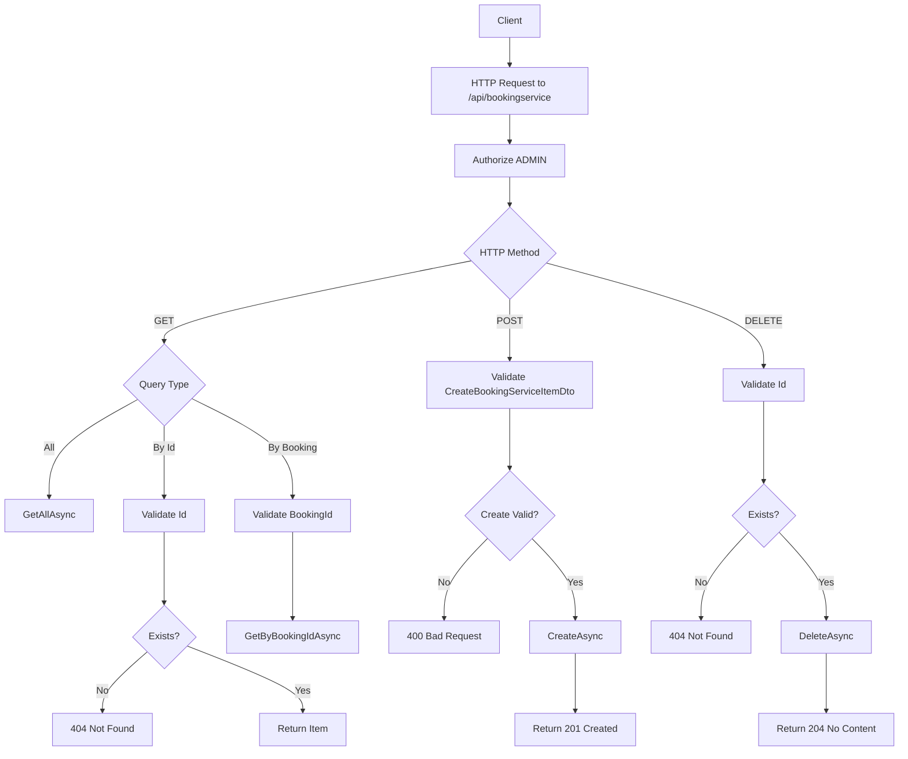

### 7.3 OrderController Flow
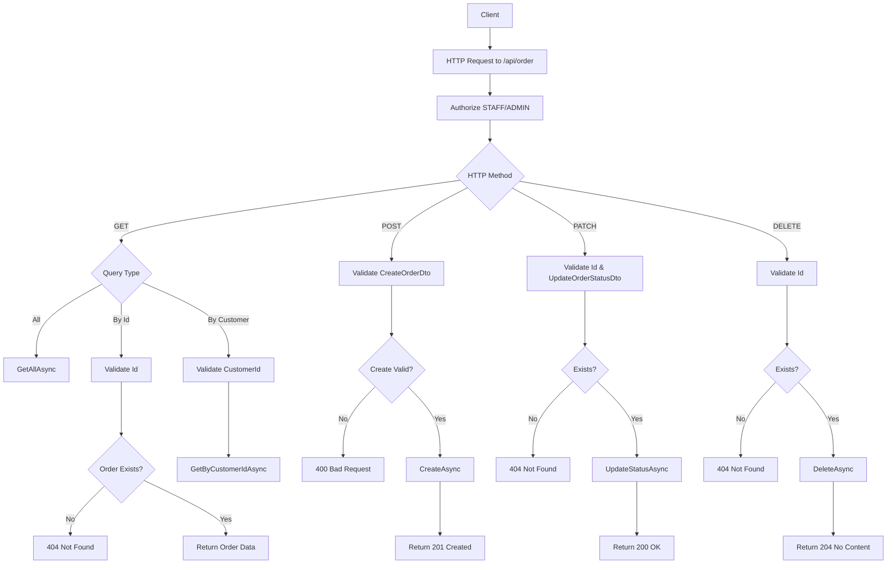

### 7.4 OrderItemController Flow
```mermaid
flowchart TD
    A[Client] --> B[HTTP Request to /api/orderitem]
    B --> C[Authorize ADMIN]
    C --> D{HTTP Method}
    D -->|GET| E{Query Type}
    E -->|All| F[GetAllAsync]
    E -->|By Id| G[Validate Id]
    E -->|By Order| H[Validate OrderId]
    G --> I{OrderItem Exists?}
    I -->|No| J[404 Not Found]
    I -->|Yes| K[Return Item Data]
    H --> L[GetByOrderIdAsync]
    D -->|POST| M[Validate CreateOrderItemDto]
    M --> N{Create Valid?}
    N -->|No| O[400 Bad Request]
    N -->|Yes| P[CreateAsync]
    P --> Q[Return 201 Created]
    D -->|PUT| R[Validate Id & UpdateOrderItemDto]
    R --> S{Exists?}
    S -->|No| T[404 Not Found]
    S -->|Yes| U[UpdateAsync]
    U --> V[Return 200 OK]
    D -->|DELETE| W[Validate Id]
    W --> X{Exists?}
    X -->|No| Y[404 Not Found]
    X -->|Yes| Z[DeleteAsync]
    Z --> AA[Return 204 No Content]
```

### 7.5 PersonController Flow (Advanced)
```mermaid
flowchart TD
    A[Client] --> B[HTTP Request to /api/person]
    B --> C[Authorize ADMIN]
    C --> D{HTTP Method}
    D -->|GET| E{Query Type}
    E -->|All| F[GetAllAsync]
    E -->|Search| G[Build PersonSearchRequest]
    E -->|By Id| H[Validate Id]
    E -->|Detail| I[Validate Id]
    E -->|By Role| J[Validate RoleId]
    H --> K{Exists?}
    K -->|No| L[404 Not Found]
    K -->|Yes| M[Return Person Data]
    I --> N{Exists?}
    N -->|No| O[404 Not Found]
    N -->|Yes| P[GetDetailByIdAsync]
    P --> Q[Return PersonDetailDto]
    J --> R[GetByRoleAsync]
    G --> S[SearchAsync with filters]
    S --> T[Return PersonSearchResponse]
    D -->|POST| U[Validate CreatePersonDto]
    U --> V{Create Valid?}
    V -->|No| W[400 Bad Request]
    V -->|Yes| X[CreateAsync]
    X --> Y[Return 201 Created]
    D -->|PUT| Z[Validate Id & UpdatePersonDto]
    Z --> AA{Exists?}
    AA -->|No| BB[404 Not Found]
    AA -->|Yes| CC[UpdateAsync]
    CC --> DD[Return 200 OK]
    D -->|DELETE| EE[Validate Id]
    EE --> FF{Exists?}
    FF -->|No| GG[404 Not Found]
    FF -->|Yes| HH[DeleteAsync]
    HH --> II[Return 204 No Content]
```

### 7.6 RoleController Flow
```mermaid
flowchart TD
    A[Client] --> B[HTTP Request to /api/role]
    B --> C[Authorize ADMIN]
    C --> D{HTTP Method}
    D -->|GET| E{Query Type}
    E -->|All| F[GetAllAsync]
    E -->|By Id| G[Validate Id]
    G --> H{Role Exists?}
    H -->|No| I[404 Not Found]
    H -->|Yes| J[Return Role Data]
    D -->|POST| K[Validate CreateRoleDto]
    K --> L{Create Valid?}
    L -->|No| M[400 Bad Request]
    L -->|Yes| N[CreateAsync]
    N --> O[Return 201 Created]
    D -->|PUT| P[Validate Id & UpdateRoleDto]
    P --> Q{Exists?}
    Q -->|No| R[404 Not Found]
    Q -->|Yes| S[UpdateAsync]
    S --> T[Return 200 OK]
    D -->|DELETE| U[Validate Id]
    U --> V{Exists?}
    V -->|No| W[404 Not Found]
    V -->|Yes| X[DeleteAsync]
    X --> Y[Return 204 No Content]
```

### 7.7 RoomController Flow
```mermaid
flowchart TD
    A[Client] --> B[HTTP Request to /api/room]
    B --> C[Authorize ADMIN]
    C --> D{HTTP Method}
    D -->|GET| E{Query Type}
    E -->|All| F[GetAllAsync]
    E -->|By Id| G[Validate Id]
    E -->|Availability| H[Validate Id & Dates]
    G --> I{Room Exists?}
    I -->|No| J[404 Not Found]
    I -->|Yes| K[Return Room Data]
    H --> L{Valid Params?}
    L -->|No| M[400 Bad Request]
    L -->|Yes| N[IsAvailableAsync]
    N --> O[Return availability status]
    D -->|POST| P[Validate CreateRoomDto]
    P --> Q{Create Valid?}
    Q -->|No| R[400 Bad Request]
    Q -->|Yes| S[CreateAsync]
    S --> T[Return 201 Created]
    D -->|PUT| U[Validate Id & UpdateRoomDto]
    U --> V{Exists?}
    V -->|No| W[404 Not Found]
    V -->|Yes| X[UpdateAsync]
    X --> Y[Return 200 OK]
    D -->|DELETE| Z[Validate Id]
    Z --> AA{Exists?}
    AA -->|No| BB[404 Not Found]
    AA -->|Yes| CC[DeleteAsync]
    CC --> DD[Return 204 No Content]
```

### 7.8 UploadController Flow
```mermaid
flowchart TD
    A[Client] --> B[HTTP Request to /api/upload]
    B --> C[Authorize User]
    C --> D{HTTP Method}
    D -->|POST| E[Validate IFormFile]
    E --> F{File Exists?}
    F -->|No| G[400 Bad Request - No file]
    F -->|Yes| H{Check File Size}
    H -->|>5MB| I[400 Bad Request - Too large]
    H -->|<=5MB| J{Check File Extension}
    J -->|Invalid| K[400 Bad Request - Invalid type]
    J -->|Valid (.jpg,.jpeg,.png,.gif,.webp)| L[Upload to Cloudinary]
    L --> M{Upload Success?}
    M -->|No| N[400 Bad Request - Upload failed]
    M -->|Yes| O[Return 200 OK + Image URLs]
    D -->|DELETE| P[Validate publicId]
    P --> Q{Valid publicId?}
    Q -->|No| R[400 Bad Request - Invalid ID]
    Q -->|Yes| S[Delete from Cloudinary]
    S --> T[Return 200 OK + Success status]
```

### 7.9 CRUD Controllers Pattern
```mermaid
flowchart TD
    subgraph "Standard CRUD Controllers"
        A[CategoryController] --> B[OrderController]
        B --> C[OrderItemController]
        C --> D[RoleController]
        D --> E[RoomController]
        E --> F[ServicesController]
        F --> G[StaffScheduleController]
        G --> H[PersonController]
        H --> I[BookingServiceController]
    end

    subgraph "CRUD Operations"
        J[GET /api/{entity}] --> K[GetAll]
        L[GET /api/{entity}/{id}] --> M[GetById]
        N[POST /api/{entity}] --> O[Create]
        P[PUT /api/{entity}/{id}] --> Q[Update]
        R[DELETE /api/{entity}/{id}] --> S[Delete]
    end

    subgraph "Advanced Operations"
        T[GET /api/{entity}/search] --> U[PersonController]
        V[GET /api/{entity}/{id}/detail] --> W[PersonController]
        X[GET /api/{entity}/availability] --> Y[RoomController]
        Z[PATCH /api/{entity}/{id}/status] --> AA[OrderController, PaymentController]
    end

    subgraph "Authorization Levels"
        BB[ADMIN Only] --> CC[ProductController, AdminController, PersonController]
        DD[STAFF/ADMIN] --> EE[BookingController, PaymentController, OrderController]
        FF[USER] --> GG[AuthController, VnPayController, UploadController]
        HH[Allow Anonymous] --> II[CategoryController (GET), VnPayController (IPN/Return)]
    end
```

## Authentication Flow Summary

```mermaid
flowchart TD
    subgraph Registration
        A[Register] --> B[Verify Email]
        B --> C[Login Success]
    end

    subgraph Authentication
        D[Login] --> E{Valid?}
        E -->|Yes| F[Return Tokens]
        E -->|No| G[401 Unauthorized]
    end

    subgraph Token Management
        H[Refresh Token] --> I{Valid?}
        I -->|Yes| J[New Tokens]
        I -->|No| K[401 Unauthorized]
        L[Logout] --> M[Invalidate Tokens]
    end

    subgraph Password Recovery
        N[Forgot Password] --> O[Request Reset]
        O --> P[Reset Password]
        P --> Q[Login with New Password]
    end
```

## Complete System Architecture Overview

```mermaid
flowchart TD
    subgraph "Frontend/Client"
        A[Web/Mobile App]
        A --> B[Authentication UI]
        A --> C[Admin Dashboard]
        A --> D[Booking System]
        A --> E[Payment Gateway]
        A --> F[Product Catalog]
        A --> G[File Upload]
    end

    subgraph "API Controllers Layer"
        H[AuthController] --> I[Login, Register, Refresh, Logout, Password Reset]
        J[AdminController] --> K[Aggregated Admin Endpoints]
        L[BookingController] --> M[Booking CRUD + Availability Checks]
        N[PaymentController] --> O[Payment CRUD + Status Updates]
        P[ProductController] --> Q[Product CRUD + Stock Management]
        R[VnPayController] --> S[VNPay Payment Processing]
        T[CategoryController] --> U[Category CRUD - Public GET]
        V[OrderController] --> W[Order CRUD + Status Updates]
        X[OrderItemController] --> Y[Order Items CRUD]
        Z[PersonController] --> AA[User Management + Advanced Search]
        BB[RoleController] --> CC[Role Management]
        DD[RoomController] --> EE[Room CRUD + Availability]
        FF[ServicesController] --> GG[Service CRUD]
        HH[StaffScheduleController] --> II[Staff Schedule Management]
        JJ[BookingServiceController] --> KK[Booking-Service Relations]
        LL[UploadController] --> MM[Cloudinary File Upload/Delete]
    end

    subgraph "Services Layer"
        NN[AuthService] --> OO[Authentication Logic]
        PP[BookingService] --> QQ[Booking Business Logic]
        RR[PaymentService] --> SS[Payment Processing]
        TT[ProductService] --> UU[Product Management]
        VV[VnPayService] --> WW[VNPay Integration]
        XX[CategoryService] --> YY[Category Logic]
        ZZ[OrderService] --> AAA[Order Processing]
        BBB[OrderItemService] --> CCC[Order Item Logic]
        DDD[PersonService] --> EEE[User Management]
        FFF[RoleService] --> GGG[Role Management]
        HHH[RoomService] --> III[Room Logic]
        JJJ[ServicesService] --> KKK[Service Logic]
        LLL[StaffScheduleService] --> MMM[Schedule Logic]
        NNN[BookingServiceService] --> OOO[Booking-Service Relations]
        PPP[CloudinaryService] --> QQQ[File Storage]
    end

    subgraph "Data Access Layer"
        RRR[(SQL Database)] --> SSS[Entity Framework Core]
        SSS --> TTT[Repository Pattern]
    end

    subgraph "External Services"
        UUU[VNPay Gateway] --> VVV[Payment Processing]
        WWW[Cloudinary] --> XXX[File Storage]
        YYY[Email Service] --> ZZZ[OTP & Notifications]
    end

    subgraph "Authorization Matrix"
        AAAA[Anonymous] --> BBBB[Category GET, VNPay IPN/Return]
        CCCC[User] --> DDDD[Auth, VnPay, Upload]
        EEEE[Staff/Admin] --> FFFF[Booking, Payment, Order]
        GGGG[Admin Only] --> HHHH[Product, Person, Role, Room, Services, etc.]
    end

    %% Flow connections
    A --> H
    A --> J
    A --> L
    A --> N
    A --> P
    A --> R
    A --> T
    A --> V
    A --> X
    A --> Z
    A --> BB
    A --> DD
    A --> FF
    A --> HH
    A --> JJ
    A --> LL

    H --> NN
    J --> PP
    J --> RR
    J --> TT
    J --> DDD
    J --> LLL
    J --> FFF
    L --> PP
    N --> RR
    P --> TT
    R --> VV
    R --> RR
    R --> PP
    R --> ZZ
    T --> XX
    V --> ZZ
    X --> BBB
    Z --> DDD
    BB --> FFF
    DD --> HHH
    FF --> JJJ
    HH --> LLL
    JJ --> NNN
    LL --> PPP

    NN --> RRR
    PP --> RRR
    RR --> RRR
    TT --> RRR
    VV --> UUU
    XX --> RRR
    ZZ --> RRR
    BBB --> RRR
    DDD --> RRR
    FFF --> RRR
    HHH --> RRR
    JJJ --> RRR
    LLL --> RRR
    NNN --> RRR
    PPP --> WWW

    VV --> YYY
    NN --> YYY
```

## API Endpoint Summary

| Controller | Endpoints | Authorization | Key Features |
|------------|-----------|---------------|--------------|
| **AuthController** | 7 endpoints | User/Anonymous | Login, Register, Refresh, Logout, Password Reset, Email Verification |
| **AdminController** | 25+ endpoints | Admin | Aggregated CRUD for all entities |
| **BookingController** | 9 endpoints | Staff/Admin | Booking CRUD, Status Updates, Availability Checks |
| **PaymentController** | 8 endpoints | Staff/Admin | Payment CRUD, Status Updates, Booking/Order Filtering |
| **ProductController** | 7 endpoints | Admin | Product CRUD, Stock Management, Category Filtering |
| **VnPayController** | 4 endpoints | User/Anonymous | VNPay Payment URLs, IPN, Return Callbacks |
| **CategoryController** | 5 endpoints | Anonymous/Admin | Category CRUD (GET public) |
| **OrderController** | 6 endpoints | Staff/Admin | Order CRUD, Status Updates, Customer Filtering |
| **OrderItemController** | 6 endpoints | Admin | Order Item CRUD, Order Filtering |
| **PersonController** | 9 endpoints | Admin | User CRUD, Advanced Search, Role Filtering |
| **RoleController** | 5 endpoints | Admin | Role CRUD |
| **RoomController** | 6 endpoints | Admin | Room CRUD, Availability Checks |
| **ServicesController** | 5 endpoints | Admin | Service CRUD |
| **StaffScheduleController** | 8 endpoints | Admin | Staff Schedule CRUD, Bulk Operations |
| **BookingServiceController** | 4 endpoints | Admin | Booking-Service Relationship CRUD |
| **UploadController** | 2 endpoints | User | Cloudinary Image Upload/Delete |

**Total: 16 Controllers, ~100+ API Endpoints**

---

# 🔧 Application Layer Architecture Diagrams

## 1. Application Layer Overview

```mermaid
flowchart TD
    subgraph "Application Layer"
        A[Controllers] --> B[Application Layer]
        B --> C[Domain Layer]
        B --> D[Infrastructure Layer]

        subgraph "Application Components"
            E[Services] --> F[Business Logic]
            G[Interfaces] --> H[Contracts]
            I[DTOs] --> J[Data Transfer Objects]
            K[Validations] --> L[Input Validation]
            M[Mappings] --> N[Object Mapping]
            O[EventHandlers] --> P[Domain Events]
            Q[Exceptions] --> R[Custom Exceptions]
        end

        subgraph "Service Dependencies"
            S[AuthService] --> T[TokenService, EmailService, OtpService]
            U[BookingService] --> V[PaymentService, RoomService]
            W[PaymentService] --> X[VnPayService, CloudinaryService]
            Y[PersonService] --> Z[SecurityService, CacheService]
        end
    end
```

## 2. Service Layer Architecture

### 2.1 Auth Service Flow
```mermaid
flowchart TD
    A[AuthService] --> B{Operation Type}

    B -->|Login| C[Validate Input]
    B -->|Register| D[Validate Input]
    B -->|Refresh| E[Validate Token]
    B -->|Logout| F[Validate Token]
    B -->|Reset Password| G[Validate OTP]
    B -->|Verify Email| H[Validate OTP]

    C --> I[Check Credentials]
    D --> J[Create User Account]
    E --> K[Generate New Tokens]
    F --> L[Invalidate Refresh Token]
    G --> M[Update Password Hash]
    H --> N[Mark Email Verified]

    I --> O[TokenService.GenerateTokens]
    J --> P[OtpService.GenerateOtp + EmailService.SendOtp]
    K --> Q[TokenService.GenerateAccessToken]
    L --> R[CacheService.RemoveToken]
    M --> S[SecurityService.HashPassword]
    N --> T[Repository.UpdateUser]

    O --> U[Return AuthResponse]
    P --> V[Return AuthResponse]
    Q --> W[Return AuthResponse]
    R --> X[Return ApiResponse]
    S --> Y[Return AuthResponse]
    T --> Z[Return AuthResponse]
```

### 2.2 Booking Service Flow
```mermaid
flowchart TD
    A[BookingService] --> B{Operation Type}

    B -->|Create| C[Validate BookingDto]
    B -->|Update| D[Validate UpdateDto]
    B -->|Update Status| E[Validate Status]
    B -->|Check Availability| F[Validate Time Slots]

    C --> G[Check Room Available]
    D --> H[Check Booking Exists]
    E --> I[Validate Status Transition]
    F --> J[Check Staff Schedule]

    G --> K[Check Staff Available]
    H --> L[Update Booking]
    I --> M[Update Status]
    J --> N[Check Conflicts]

    K --> O[Create Booking]
    L --> P[Return Updated Booking]
    M --> Q[Return Updated Booking]
    N --> R[Return Availability]

    O --> S[PaymentService.CreateIfNeeded]
    S --> T[Return BookingDto]
```

### 2.3 Payment Service Flow
```mermaid
flowchart TD
    A[PaymentService] --> B{Operation Type}

    B -->|Create| C[Validate PaymentDto]
    B -->|Update Status| D[Validate Status]
    B -->|Get By Booking| E[Validate BookingId]
    B -->|Get By Order| F[Validate OrderId]

    C --> G{Type: Booking?}
    D --> H{Status: Completed?}
    E --> I[Find Booking Payments]
    F --> J[Find Order Payments]

    G -->|Yes| K[Validate Booking Amount]
    G -->|No| L[Validate Order Amount]
    H -->|Yes| M[Update Related Entities]
    H -->|No| N[Update Payment Only]

    K --> O[Create Payment Record]
    L --> P[Create Payment Record]
    M --> Q{Booking Payment?}
    N --> R[Return Updated Payment]

    Q -->|Yes| S[Update Booking Status]
    Q -->|No| T[Update Order Status]
    S --> U[Return PaymentDto]
    T --> U
```

## 3. DTO Layer Architecture

### 3.1 DTO Categories
```mermaid
flowchart TD
    subgraph "Authentication DTOs"
        A[LoginDTO] --> B[username, password, deviceToken]
        C[RegisterDTO] --> D[name, email, username, password, phone, address]
        E[AuthResponse] --> F[status, message, accessToken, refreshToken, user, expiresIn]
    end

    subgraph "Entity DTOs"
        G[BookingDto] --> H[Id, Customer, Staff, Room, Services, TotalAmount, Status]
        I[OrderDto] --> J[Id, Customer, Items, TotalAmount, Status]
        K[PaymentDto] --> L[Id, Type, Amount, Method, Status]
        M[PersonDto] --> N[Id, Name, Email, Phone, Username, Role]
    end

    subgraph "Request/Response DTOs"
        O[CreateBookingDto] --> P[customerId, staffId, roomId, services, startTime, endTime]
        Q[UpdateBookingDto] --> R[services, startTime, endTime, notes]
        S[PersonSearchRequest] --> T[search, name, email, phone, roleId, dateRange, pagination]
        U[PersonSearchResponse] --> V[items, totalCount, page, pageSize]
    end

    subgraph "VnPay DTOs"
        W[CreateVnPayBookingPaymentDto] --> X[bookingId]
        Y[CreateVnPayOrderPaymentDto] --> Z[orderId]
        AA[VnPayRequestDto] --> BB[orderId, amount, description, orderType]
        CC[VnPayResponseDto] --> DD[orderId, success, message, transactionNo]
    end
```

## 4. Validation Layer Architecture

### 4.1 Validation Flow
```mermaid
flowchart TD
    A[Input Request] --> B[ValidationFilter]
    B --> C{Valid Input?}

    C -->|No| D[ValidationException]
    C -->|Yes| E[Service Layer]

    D --> F[Return 400 Bad Request]

    subgraph "Validation Rules"
        G[EmailValidator] --> H[Format Check + Domain Check]
        I[PasswordValidator] --> J[Length + Complexity + Special Chars]
        K[OtpValidator] --> L[Format + Length + Expiration]
        M[BookingValidators] --> N[Time Conflicts + Staff Availability]
        O[PaymentValidators] --> P[Amount Validation + Type Consistency]
    end

    subgraph "Custom Validators"
        Q[InputValidator] --> R[Generic Input Sanitization]
        S[DateTimeValidator] --> T[Business Hours + Future Dates]
        U[PhoneValidator] --> V[Format + Country Code]
    end
```

## 5. Mapping Layer Architecture

### 5.1 Object Mapping Flow
```mermaid
flowchart TD
    A[Entity] --> B[Mapper]
    B --> C[DTO]

    subgraph "Entity to DTO Mapping"
        D[Person] --> E[PersonMapper]
        E --> F[PersonDto]
        G[Booking] --> H[BookingMapper]
        H --> I[BookingDto]
        J[Order] --> K[OrderMapper]
        K --> L[OrderDto]
    end

    subgraph "DTO to Entity Mapping"
        M[CreatePersonDto] --> N[PersonMapper]
        N --> O[Person Entity]
        P[UpdateBookingDto] --> Q[BookingMapper]
        Q --> R[Booking Entity]
    end

    subgraph "Complex Mappings"
        S[PersonSearchRequest] --> T[PersonMapper]
        T --> U[EF Query]
        V[Booking With Services] --> W[BookingMapper]
        W --> X[BookingDto With ServiceItems]
    end
```

## 6. Event Handling Architecture

### 6.1 Domain Events Flow
```mermaid
flowchart TD
    A[Domain Entity] --> B[Domain Event]
    B --> C[Event Dispatcher]
    C --> D[Event Handler]

    subgraph "Booking Events"
        E[BookingCreatedEvent] --> F[BookingEventHandler]
        G[BookingStatusChangedEvent] --> H[BookingEventHandler]
        I[PaymentCompletedEvent] --> J[BookingEventHandler]
    end

    subgraph "Event Handlers"
        F --> K[Send Confirmation Email]
        H --> L[Update Related Entities]
        J --> M[Trigger Notifications]
    end

    subgraph "Event Flow"
        N[Service Method] --> O[Entity Change]
        O --> P[Raise Domain Event]
        P --> Q[EventDispatcher.Publish]
        Q --> R[Registered Handlers]
        R --> S[Execute Handler Logic]
    end
```

## 7. Exception Handling Architecture

### 7.1 Exception Hierarchy
```mermaid
flowchart TD
    A[Exception] --> B[Custom Exceptions]

    B --> C[BusinessException]
    B --> D[ValidationException]
    B --> E[NotFoundException]
    B --> F[AuthenticationException]
    B --> G[AuthorizationException]
    B --> H[ConflictException]
    B --> I[RateLimitException]

    subgraph "Exception Handling"
        J[Controller] --> K[Try-Catch Block]
        L[Service] --> M[Throw Custom Exception]
        N[Repository] --> O[Throw Custom Exception]
    end

    subgraph "Middleware Handling"
        P[ExceptionHandlingMiddleware] --> Q[Catch All Exceptions]
        Q --> R{Exception Type}
        R -->|Custom| S[Return Proper HTTP Status]
        R -->|System| T[Return 500 Internal Server Error]
        R -->|Validation| U[Return 400 Bad Request + Details]
    end
```

## 8. Domain Layer Overview

### 8.1 Domain Layer Architecture
```mermaid
flowchart TD
    subgraph "Domain Layer"
        A[Entities] --> B[Business Objects]
        C[Enums] --> D[Value Objects]
        E[Events] --> F[Domain Events]
        G[Repositories] --> H[Data Access Contracts]

        subgraph "Entity Categories"
            I[Core Entities] --> J[Person, Role, Product, Category]
            K[Transaction Entities] --> L[Booking, Order, Payment, OrderItem]
            M[Supporting Entities] --> N[Room, Service, StaffSchedule, BookingService]
        end

        subgraph "Repository Pattern"
            O[IGenericRepository<T>] --> P[CRUD Operations]
            Q[IUnitOfWork] --> R[Transaction Management]
            S[Specific Repositories] --> T[Entity-Specific Queries]
        end
    end
```

## 9. Entity Relationship Diagram (ERD)

### 9.1 Core Entity Relationships
```mermaid
erDiagram
    Person ||--o{ Booking : "creates_as_customer"
    Person ||--o{ Booking : "serves_as_staff"
    Person ||--o{ Order : "places"
    Person ||--o{ Payment : "makes"
    Person ||--o{ StaffSchedule : "has"
    Person }o--|| Role : "belongs_to"

    Role ||--o{ Person : "has_many"

    Booking ||--o{ Payment : "has"
    Booking ||--o{ BookingService : "contains"
    Booking }o--|| Person : "customer"
    Booking }o--|| Person : "staff"
    Booking }o--|| Room : "in"

    BookingService }o--|| Booking : "belongs_to"
    BookingService }o--|| Service : "references"

    Order ||--o{ OrderItem : "contains"
    Order ||--o{ Payment : "has"
    Order }o--|| Person : "customer"

    OrderItem }o--|| Order : "belongs_to"
    OrderItem }o--|| Product : "references"

    Payment }o--|| Person : "made_by"
    Payment }o--o| Booking : "for_booking"
    Payment }o--o| Order : "for_order"

    Product }o--|| Category : "belongs_to"
    Service }o--|| Category : "belongs_to"

    Category ||--o{ Product : "has"
    Category ||--o{ Service : "has"

    Room ||--o{ Booking : "hosts"
    Room ||--o{ StaffSchedule : "assigned_to"

    StaffSchedule }o--|| Person : "staff"
    StaffSchedule }o--|| Room : "room"
```

### 9.2 Entity Details
```mermaid
classDiagram
    class Person {
        +long Id
        +string Name
        +string Email
        +string Phone
        +string Address
        +string Username
        +string PasswordHash
        +long RoleId
        +bool StatusVerify
        +string OTP
        +DateTime CreatedAt
        +DateTime UpdatedAt
        +List~Booking~ BookingCustomers
        +List~Booking~ BookingStaffs
        +List~Order~ Orders
        +List~Payment~ Payments
        +Role Role
        +List~StaffSchedule~ StaffSchedules
    }

    class Booking {
        +long Id
        +long CustomerId
        +long StaffId
        +long RoomId
        +DateTime StartTime
        +DateTime EndTime
        +decimal TotalAmount
        +StatusBooking Status
        +string Notes
        +DateTime CreatedAt
        +DateTime UpdatedAt
        +Person Customer
        +Person Staff
        +Room Room
        +List~BookingService~ BookingServices
        +List~Payment~ Payments
    }

    class Payment {
        +long Id
        +Payment_type Type
        +long? BookingId
        +long? OrderId
        +long PersonalId
        +decimal Amount
        +PaymentMethod Method
        +PaymentStatus Status
        +string TransactionId
        +DateTime CreatedAt
        +DateTime UpdatedAt
        +Person Person
        +Booking? Booking
        +Order? Order
    }

    class Order {
        +long Id
        +long CustomerId
        +decimal TotalAmount
        +OrderStatus Status
        +string Notes
        +DateTime CreatedAt
        +DateTime UpdatedAt
        +Person Customer
        +List~OrderItem~ OrderItems
        +List~Payment~ Payments
    }

    Person ||--o{ Booking : customer
    Person ||--o{ Booking : staff
    Person ||--o{ Order : customer
    Person ||--o{ Payment : person
    Booking ||--o{ Payment : payments
    Order ||--o{ Payment : payments
```

## 10. Repository Pattern Architecture

### 10.1 Repository Interfaces
```mermaid
flowchart TD
    subgraph "Repository Interfaces"
        A[IGenericRepository<T>] --> B[CRUD Operations]
        C[IUnitOfWork] --> D[Transaction Management]

        B --> E[Task<T?> GetByIdAsync(long id)]
        B --> F[Task<IEnumerable<T>> GetAllAsync()]
        B --> G[Task<T> CreateAsync(T entity)]
        B --> H[Task<T> UpdateAsync(T entity)]
        B --> I[Task<bool> DeleteAsync(long id)]

        D --> J[Task<int> SaveChangesAsync()]
        D --> K[Task BeginTransactionAsync()]
        D --> L[Task CommitTransactionAsync()]
        D --> M[Task RollbackTransactionAsync()]
    end

    subgraph "Specific Repositories"
        N[IPersonRepository] --> O[IGenericRepository<Person>]
        P[IBookingRepository] --> Q[IGenericRepository<Booking>]
        R[IPaymentRepository] --> S[IGenericRepository<Payment>]
        T[IOrderRepository] --> U[IGenericRepository<Order>]
        V[IProductRepository] --> W[IGenericRepository<Product>]
        X[IStaffScheduleRepository] --> Y[IGenericRepository<StaffSchedule>]
    end

    subgraph "Specialized Methods"
        O --> Z[Task<Person?> GetByUsernameAsync(string username)]
        P --> AA[Task<IEnumerable<Booking>> GetByCustomerIdAsync(long customerId)]
        R --> BB[Task<IEnumerable<Payment>> GetByBookingIdAsync(long bookingId)]
        T --> CC[Task<IEnumerable<Order>> GetByCustomerIdAsync(long customerId)]
        V --> DD[Task<IEnumerable<Product>> GetByCategoryAsync(long categoryId)]
    end
```

### 10.2 Repository Implementation Flow
```mermaid
flowchart TD
    A[Service Layer] --> B[Repository Interface]
    B --> C[Repository Implementation]
    C --> D[Entity Framework Core]
    D --> E[Database Context]
    E --> F[SQL Database]

    subgraph "Query Flow"
        G[GetById] --> H[DbSet<T>.FindAsync(id)]
        I[GetAll] --> J[DbSet<T>.ToListAsync()]
        K[Create] --> L[DbSet<T>.Add(entity)]
        M[Update] --> N[DbContext.Entry(entity).State = Modified]
        O[Delete] --> P[DbSet<T>.Remove(entity)]
    end

    subgraph "Transaction Management"
        Q[UnitOfWork] --> R[BeginTransaction]
        R --> S[Execute Operations]
        S --> T{Success?}
        T -->|Yes| U[Commit]
        T -->|No| V[Rollback]
    end
```

## 11. Domain Events Architecture

### 11.1 Event System
```mermaid
flowchart TD
    A[Domain Entity] --> B[Change Occurs]
    B --> C[Raise Domain Event]
    C --> D[IDomainEvent Interface]
    D --> E[Event Dispatcher]
    E --> F[Event Handlers]

    subgraph "Domain Events"
        G[BookingCreatedEvent] --> H[Data: BookingId, CustomerId, TotalAmount]
        I[BookingStatusChangedEvent] --> J[Data: BookingId, OldStatus, NewStatus]
        K[PaymentCompletedEvent] --> L[Data: PaymentId, Amount, Type]
        M[UserRegisteredEvent] --> N[Data: UserId, Email]
    end

    subgraph "Event Handlers"
        O[BookingEventHandler] --> P[SendEmail, UpdateCache, LogActivity]
        Q[PaymentEventHandler] --> R[UpdateBookingStatus, SendNotification]
        S[UserEventHandler] --> T[SendWelcomeEmail, CreateDefaultSettings]
    end

    subgraph "Event Flow"
        U[Service Method] --> V[Entity Operation]
        V --> W[Entity.AddDomainEvent(event)]
        W --> X[UnitOfWork.SaveChangesAsync()]
        X --> Y[EventDispatcher.PublishEvents()]
        Y --> Z[Execute Handlers]
    end
```

## 12. Enums and Value Objects

### 12.1 Enum Definitions
```mermaid
flowchart TD
    subgraph "Status Enums"
        A[StatusBooking] --> B[PENDING, CONFIRMED, IN_PROGRESS, COMPLETED, CANCELLED]
        C[OrderStatus] --> D[PENDING, PROCESSING, SHIPPED, DELIVERED, CANCELLED]
        E[PaymentStatus] --> F[PENDING, COMPLETED, FAILED, REFUNDED]
    end

    subgraph "Type Enums"
        G[Payment_type] --> H[BOOKING, ORDER]
        I[PaymentMethod] --> J[VNPay, CASH, CARD, OTHER]
        K[ShiftName] --> L[MORNING, AFTERNOON, EVENING, NIGHT]
    end

    subgraph "Usage in Entities"
        M[Booking.Status] --> A
        N[Order.Status] --> C
        O[Payment.Status] --> E
        P[Payment.Type] --> G
        Q[Payment.Method] --> I
        R[StaffSchedule.Shift] --> K
    end
```

## 13. Infrastructure Layer Overview

### 13.1 Infrastructure Architecture
```mermaid
flowchart TD
    subgraph "Infrastructure Layer"
        A[Data Access] --> B[Entity Framework Core]
        C[Caching] --> D[Redis Cache]
        E[External Services] --> F[Cloudinary, VNPay]
        G[Event Handling] --> H[Event Dispatcher]

        subgraph "Repository Implementations"
            I[GenericRepository] --> J[Base CRUD Operations]
            K[SpecificRepositories] --> L[Custom Queries]
            M[UnitOfWork] --> N[Transaction Management]
        end

        subgraph "External Integrations"
            O[VnPayService] --> P[Payment Gateway]
            Q[CloudinaryService] --> R[File Storage]
            S[RedisCacheService] --> T[Distributed Cache]
        end
    end
```

## 14. Repository Implementation Architecture

### 14.1 Repository Implementation Pattern
```mermaid
flowchart TD
    subgraph "Repository Base Classes"
        A[GenericRepository<T>] --> B[Implements IGenericRepository<T>]
        C[UnitOfWork] --> D[Implements IUnitOfWork]

        B --> E[DbContext _context]
        D --> F[DbContext _context]
    end

    subgraph "CRUD Implementation"
        G[GetByIdAsync] --> H[_context.Set<T>.FindAsync(id)]
        I[GetAllAsync] --> J[_context.Set<T>.ToListAsync()]
        K[CreateAsync] --> L[_context.Set<T>.Add(entity)]
        M[UpdateAsync] --> N[_context.Entry(entity).State = Modified]
        O[DeleteAsync] --> P[_context.Set<T>.Remove(entity)]
    end

    subgraph "Specific Repository Examples"
        Q[PersonRepository] --> R[GetByUsernameAsync()]
        S[BookingRepository] --> T[GetByCustomerIdAsync()]
        U[PaymentRepository] --> V[GetByBookingIdAsync()]
        W[OrderRepository] --> X[GetByCustomerIdAsync()]
    end

    subgraph "Transaction Management"
        Y[BeginTransactionAsync] --> Z[_context.Database.BeginTransactionAsync()]
        AA[CommitTransactionAsync] --> BB[_context.Database.CommitTransactionAsync()]
        CC[RollbackTransactionAsync] --> DD[_context.Database.RollbackTransactionAsync()]
        EE[SaveChangesAsync] --> FF[_context.SaveChangesAsync()]
    end
```

### 14.2 Repository Dependencies
```mermaid
flowchart TD
    A[Controller] --> B[Service]
    B --> C[Repository Interface]
    C --> D[Repository Implementation]
    D --> E[DbContext]
    E --> F[Database]

    subgraph "Dependency Injection"
        G[Program.cs] --> H[services.AddScoped<IRepository, Repository>()]
        I[Service Constructor] --> J[IRepository repository]
        K[Repository Constructor] --> L[ServicemassageContext context]
    end

    subgraph "Context Configuration"
        M[ServicemassageContext] --> N[OnModelCreating()]
        O[Entity Configurations] --> P[Relationships, Constraints]
        Q[DbSet<T> Properties] --> R[Entity Access]
    end
```

## 15. Caching Architecture

### 15.1 Redis Cache Implementation
```mermaid
flowchart TD
    subgraph "Cache Service"
        A[RedisCacheService] --> B[Implements ICacheRediservice]
        C[ICacheRediservice] --> D[Cache Operations Interface]

        B --> E[ConnectionMultiplexer _redis]
        B --> F[IDatabase _db]
    end

    subgraph "Cache Operations"
        G[SetAsync] --> H[_db.StringSetAsync(key, value, expiry)]
        I[GetAsync] --> J[_db.StringGetAsync(key)]
        K[RemoveAsync] --> L[_db.KeyDeleteAsync(key)]
        M[ExistsAsync] --> N[_db.KeyExistsAsync(key)]
    end

    subgraph "Cache Usage Examples"
        O[AuthService] --> P[Store Refresh Tokens]
        Q[OtpService] --> R[Store OTP Codes]
        S[PersonService] --> T[Cache User Permissions]
        U[BookingService] --> V[Cache Availability Data]
    end

    subgraph "Cache Keys Pattern"
        W[refresh_token:{userId}:{deviceId}] --> X[Token Storage]
        Y[otp:{email}] --> Z[OTP Storage]
        AA[user_permissions:{userId}] --> BB[Permissions Cache]
        CC[booking_availability:{staffId}:{date}] --> DD[Availability Cache]
    end
```

### 15.2 Cache Strategy
```mermaid
flowchart TD
    A[Service Method] --> B{Cache Hit?}
    B -->|Yes| C[Return Cached Data]
    B -->|No| D[Query Database]
    D --> E[Store in Cache]
    E --> F[Return Data]

    subgraph "Cache Expiration"
        G[OTP Codes] --> H[5 minutes]
        I[Refresh Tokens] --> J[7 days]
        K[User Permissions] --> L[1 hour]
        M[Availability Data] --> N[30 minutes]
    end

    subgraph "Cache Invalidation"
        O[User Logout] --> P[Remove Refresh Token]
        Q[Password Change] --> R[Remove User Cache]
        S[Booking Update] --> T[Remove Availability Cache]
        U[Permission Change] --> V[Remove Permission Cache]
    end
```

## 16. External Services Integration

### 16.1 VNPay Service Architecture
```mermaid
flowchart TD
    subgraph "VNPay Integration"
        A[VnPayService] --> B[Implements IVnPayService]

        B --> C[CreatePaymentUrl()]
        B --> D[ProcessCallback()]
        B --> E[VerifySignature()]
    end

    subgraph "Payment Flow"
        F[Create Payment URL] --> G[Build VNPay Parameters]
        G --> H[Sort Parameters]
        H --> I[Create Hash]
        I --> J[Build Payment URL]
        J --> K[Return to Client]
    end

    subgraph "Callback Processing"
        L[Receive Callback] --> M[Extract Parameters]
        M --> N[Verify Signature]
        N --> O{Valid?}
        O -->|Yes| P[Process Payment]
        O -->|No| Q[Return Error]
        P --> R[Update Payment Status]
        R --> S[Return Success]
    end

    subgraph "VNPay Parameters"
        T[vnp_TmnCode] --> U[Merchant Code]
        V[vnp_Amount] --> W[Payment Amount]
        X[vnp_OrderInfo] --> Y[Order Description]
        Z[vnp_OrderType] --> AA[Order Type]
        BB[vnp_ReturnUrl] --> CC[Return URL]
        DD[vnp_TxnRef] --> EE[Transaction Reference]
    end
```

### 16.2 Cloudinary Service Architecture
```mermaid
flowchart TD
    subgraph "Cloudinary Integration"
        A[CloudinaryService] --> B[Implements ICloudinaryService]

        B --> C[UploadImageAsync()]
        B --> D[DeleteImageAsync()]
    end

    subgraph "File Upload Flow"
        E[Receive IFormFile] --> F[Validate File]
        F --> G{Check Size & Type?}
        G -->|Invalid| H[Throw Exception]
        G -->|Valid| I[Create UploadParams]
        I --> J[Upload to Cloudinary]
        J --> K{Upload Success?}
        K -->|Yes| L[Return UploadResult]
        K -->|No| M[Throw Exception]
    end

    subgraph "File Delete Flow"
        N[Receive PublicId] --> O[Create DeletionParams]
        O --> P[Delete from Cloudinary]
        P --> Q{Delete Success?}
        Q -->|Yes| R[Return true]
        Q -->|No| S[Return false]
    end

    subgraph "Upload Parameters"
        T[File] --> U[Stream]
        V[PublicId] --> W[Unique Identifier]
        X[Folder] --> Y[Organization Path]
        Z[Transformation] --> AA[Resize, Crop, etc.]
    end
```

## 17. Event Dispatcher Implementation

### 17.1 Event Handling System
```mermaid
flowchart TD
    subgraph "Event Dispatcher"
        A[EventDispatcher] --> B[Implements IEventDispatcher]
        C[IEventDispatcher] --> D[PublishAsync<T>()]

        A --> E[IServiceProvider _serviceProvider]
    end

    subgraph "Event Publishing"
        F[Domain Event] --> G[EventDispatcher.PublishAsync()]
        G --> H[Get Event Handlers]
        H --> I[Resolve from DI Container]
        I --> J[Execute Handlers]
    end

    subgraph "Handler Registration"
        K[Program.cs] --> L[services.AddTransient<IEventHandler<Event>, Handler>()]
        M[EventDispatcher] --> N[GetServices(typeof(IEventHandler<>))]
    end

    subgraph "Event Processing"
        O[UnitOfWork.SaveChangesAsync()] --> P[Collect Domain Events]
        P --> Q[Clear Events from Entities]
        Q --> R[Publish Each Event]
        R --> S[Execute Handlers]
        S --> T[Log Results]
    end
```

## 18. API Layer Extensions & Components

### 18.1 Extensions Architecture
```mermaid
flowchart TD
    subgraph "Service Extensions"
        A[ServiceCollectionExtensions] --> B[AddApplicationServices()]
        C[DatabaseExtentions] --> D[AddDatabaseContext()]
        E[HealthCheckExtensions] --> F[AddHealthChecks()]
        G[MapperCollectionExtentions] --> H[AddAutoMapper()]
        I[ValidationExtensions] --> J[AddFluentValidation()]
    end

    subgraph "Service Registration"
        B --> K[Register All Application Services]
        D --> L[Configure DbContext with SQL Server]
        F --> M[Add Database Health Checks]
        H --> N[Configure AutoMapper Profiles]
        J --> O[Register Validators]
    end

    subgraph "Extension Methods"
        P[AddApplicationLayer()] --> Q[Application Services]
        R[AddInfrastructureLayer()] --> S[Infrastructure Services]
        T[AddApiLayer()] --> U[API Configurations]
    end
```

### 18.2 Middleware Pipeline

#### 18.2.1 Request Pipeline Flow
```mermaid
flowchart TD
    A[HTTP Request] --> B[Exception Handling Middleware]
    B --> C[Authentication Middleware]
    C --> D[Authorization Middleware]
    D --> E[CORS Middleware]
    E --> F[Routing Middleware]
    F --> G[Endpoint Middleware]
    G --> H[Response]

    subgraph "ExceptionHandlingMiddleware"
        I[Catch All Exceptions] --> J{Exception Type}
        J -->|ValidationException| K[Return 400 + Details]
        J -->|NotFoundException| L[Return 404 + Message]
        J -->|BusinessException| M[Return 400 + Message]
        J -->|AuthenticationException| N[Return 401]
        J -->|AuthorizationException| O[Return 403]
        J -->|Other| P[Return 500 + Generic Message]
    end

    subgraph "Built-in Middlewares"
        Q[Authentication] --> R[JWT Token Validation]
        S[Authorization] --> T[Role-based Access Control]
        U[CORS] --> V[Cross-Origin Requests]
        W[Routing] --> X[Endpoint Matching]
    end
```

#### 18.2.2 Exception Handling Details
```mermaid
flowchart TD
    A[Exception Occurs] --> B[ExceptionHandlingMiddleware]
    B --> C[Log Exception Details]
    C --> D{Exception Type}

    D -->|ValidationException| E[Extract Validation Errors]
    D -->|BusinessException| F[Extract Business Message]
    D -->|NotFoundException| G[Extract Not Found Message]
    D -->|AuthenticationException| H[Set 401 Status]
    D -->|AuthorizationException| I[Set 403 Status]
    D -->|ConflictException| J[Set 409 Status]
    D -->|RateLimitException| K[Set 429 Status]
    D -->|System.Exception| L[Set 500 Status]

    E --> M[Return JSON Response]
    F --> M
    G --> M
    H --> N[Return Empty Response]
    I --> N
    J --> N
    K --> N
    L --> O[Return Generic Error]

    M --> P[Include Error Details]
    N --> Q[No Body Content]
    O --> R[Hide Sensitive Information]
```

### 18.3 Filters Architecture

#### 18.3.1 Validation Filter
```mermaid
flowchart TD
    A[Action Executing] --> B[ValidationFilter]
    B --> C[Get Action Parameters]
    C --> D[Extract Validatable Objects]
    D --> E[Run FluentValidation]
    E --> F{Validation Passed?}

    F -->|Yes| G[Continue to Action]
    F -->|No| H[Collect Validation Errors]
    H --> I[Create ValidationException]
    I --> J[Throw Exception]

    subgraph "Validation Process"
        K[ModelState Validation] --> L[Data Annotations]
        M[FluentValidation] --> N[Custom Rules]
        O[Business Rules] --> P[Cross-field Validation]
    end

    subgraph "Error Response"
        Q[ValidationException] --> R[ExceptionHandlingMiddleware]
        R --> S[Format Error Response]
        S --> T[Return 400 Bad Request]
    end
```

### 18.4 Helper Classes

#### 18.4.1 ApiResponseHelper
```mermaid
flowchart TD
    subgraph "Response Helpers"
        A[ApiResponseHelper] --> B[CreateSuccessResponse()]
        A --> C[CreateErrorResponse()]
        A --> D[CreateValidationErrorResponse()]

        B --> E[Success: true, Data, Message]
        C --> F[Success: false, Error Message]
        D --> G[Success: false, Validation Errors]
    end

    subgraph "Response Wrapper"
        H[ApiResponseWrapper<T>] --> I[Success Response]
        H --> J[Error Response]
        H --> K[Paged Response]

        I --> L[Status, Message, Data]
        J --> M[Status, Message, Errors]
        K --> N[Status, Message, Data, Pagination]
    end

    subgraph "Usage in Controllers"
        O[Controller Method] --> P[Call Service]
        P --> Q{Result.Success?}
        Q -->|Yes| R[Return OkResponse(result.Data)]
        Q -->|No| S[Return ErrorResponse(result.Error)]
    end
```

## 19. Program.cs Architecture

### 19.1 Application Startup Flow
```mermaid
flowchart TD
    A[Program.cs] --> B[CreateBuilder()]
    B --> C[Configure Services]
    C --> D[Configure Pipeline]
    D --> E[Run Application]

    subgraph "Service Configuration"
        F[Add Controllers] --> G[Add API Controllers]
        H[Add Database] --> I[SQL Server Connection]
        J[Add Identity] --> K[JWT Authentication]
        L[Add Caching] --> M[Redis Configuration]
        N[Add External] --> O[VNPay, Cloudinary]
        P[Add Validation] --> Q[FluentValidation]
        R[Add Mapping] --> S[AutoMapper]
    end

    subgraph "Middleware Pipeline"
        T[Exception Handling] --> U[Global Error Handling]
        V[Authentication] --> W[JWT Token Validation]
        X[Authorization] --> Y[Role-based Access]
        Z[CORS] --> AA[Cross-Origin Policy]
        BB[Static Files] --> CC[File Serving]
        DD[Routing] --> EE[Endpoint Routing]
        FF[Swagger] --> GG[API Documentation]
    end

    subgraph "Environment Configuration"
        HH[appsettings.json] --> II[Base Configuration]
        JJ[appsettings.Development.json] --> KK[Development Settings]
        LL[Environment Variables] --> MM[Override Settings]
        NN[User Secrets] --> OO[Development Secrets]
    end
```

### 19.2 Dependency Injection Configuration
```mermaid
flowchart TD
    A[Service Collection] --> B[Register Services]

    subgraph "Service Lifetimes"
        C[Transient] --> D[New Instance Each Time]
        E[Scoped] --> F[One Instance Per Request]
        G[Singleton] --> H[One Instance Per Application]
    end

    subgraph "Service Registrations"
        I[Controllers] --> J[AddControllers()]
        K[DbContext] --> L[AddDbContext<>()]
        M[Services] --> N[AddScoped<IService, Service>()]
        O[External APIs] --> P[AddHttpClient()]
        Q[Cache] --> R[AddStackExchangeRedisCache()]
        S[Options] --> T[Configure<Options>()]
    end

    subgraph "Custom Extensions"
        U[AddApplicationLayer()] --> V[Register App Services]
        W[AddInfrastructureLayer()] --> X[Register Infra Services]
        Y[AddApiLayer()] --> Z[Configure API Features]
    end
```

## 20. Database Schema & Entity Framework

### 20.1 Database Architecture Overview
```mermaid
flowchart TD
    subgraph "Database Layer"
        A[MySQL 9.0.1] --> B[Servicemassage Database]
        B --> C[Entity Framework Core 8.0]
        C --> D[Code First Approach]

        subgraph "Database Objects"
            E[Tables] --> F[Entities]
            G[Indexes] --> H[Performance Optimization]
            I[Foreign Keys] --> J[Data Integrity]
            K[Views] --> L[Precomputed Queries]
        end
    end

    subgraph "Migration System"
        M[EF Migrations] --> N[Schema Changes]
        O[Up/Down Scripts] --> P[Version Control]
        Q[Database Snapshots] --> R[State Management]
    end
```

### 20.2 Complete Database Schema

#### 20.2.1 Core Tables Schema
```sql
-- Person (Users) Table
CREATE TABLE person (
    id BIGINT PRIMARY KEY AUTO_INCREMENT,
    name VARCHAR(255) NOT NULL,
    email VARCHAR(255),
    phone VARCHAR(20),
    address TEXT,
    username VARCHAR(100) NOT NULL UNIQUE,
    password_hash VARCHAR(500) NOT NULL,
    role_id BIGINT NOT NULL,
    status_verify BOOLEAN DEFAULT FALSE,
    otp VARCHAR(10),
    created_at TIMESTAMP DEFAULT CURRENT_TIMESTAMP,
    updated_at TIMESTAMP DEFAULT CURRENT_TIMESTAMP ON UPDATE CURRENT_TIMESTAMP,
    FOREIGN KEY (role_id) REFERENCES role(id)
);

-- Role Table
CREATE TABLE role (
    id BIGINT PRIMARY KEY AUTO_INCREMENT,
    name VARCHAR(50) NOT NULL UNIQUE,
    description TEXT,
    created_at TIMESTAMP DEFAULT CURRENT_TIMESTAMP,
    updated_at TIMESTAMP DEFAULT CURRENT_TIMESTAMP ON UPDATE CURRENT_TIMESTAMP
);

-- Category Table
CREATE TABLE category (
    id BIGINT PRIMARY KEY AUTO_INCREMENT,
    name VARCHAR(255) NOT NULL,
    description TEXT,
    image_url VARCHAR(500),
    created_at TIMESTAMP DEFAULT CURRENT_TIMESTAMP,
    updated_at TIMESTAMP DEFAULT CURRENT_TIMESTAMP ON UPDATE CURRENT_TIMESTAMP
);

-- Product Table
CREATE TABLE product (
    id BIGINT PRIMARY KEY AUTO_INCREMENT,
    name VARCHAR(255) NOT NULL,
    description TEXT,
    price DECIMAL(10,2) NOT NULL,
    stock_quantity INT DEFAULT 0,
    image_url VARCHAR(500),
    category_id BIGINT NOT NULL,
    created_at TIMESTAMP DEFAULT CURRENT_TIMESTAMP,
    updated_at TIMESTAMP DEFAULT CURRENT_TIMESTAMP ON UPDATE CURRENT_TIMESTAMP,
    FOREIGN KEY (category_id) REFERENCES category(id)
);

-- Service Table
CREATE TABLE service (
    id BIGINT PRIMARY KEY AUTO_INCREMENT,
    name VARCHAR(255) NOT NULL,
    description TEXT,
    price DECIMAL(10,2) NOT NULL,
    duration_minutes INT NOT NULL,
    image_url VARCHAR(500),
    category_id BIGINT NOT NULL,
    created_at TIMESTAMP DEFAULT CURRENT_TIMESTAMP,
    updated_at TIMESTAMP DEFAULT CURRENT_TIMESTAMP ON UPDATE CURRENT_TIMESTAMP,
    FOREIGN KEY (category_id) REFERENCES category(id)
);

-- Room Table
CREATE TABLE room (
    id BIGINT PRIMARY KEY AUTO_INCREMENT,
    name VARCHAR(255) NOT NULL,
    description TEXT,
    capacity INT DEFAULT 1,
    is_active BOOLEAN DEFAULT TRUE,
    created_at TIMESTAMP DEFAULT CURRENT_TIMESTAMP,
    updated_at TIMESTAMP DEFAULT CURRENT_TIMESTAMP ON UPDATE CURRENT_TIMESTAMP
);
```

#### 20.2.2 Transaction Tables Schema
```sql
-- Booking Table
CREATE TABLE booking (
    id BIGINT PRIMARY KEY AUTO_INCREMENT,
    customer_id BIGINT NOT NULL,
    staff_id BIGINT NOT NULL,
    room_id BIGINT NOT NULL,
    start_time DATETIME NOT NULL,
    end_time DATETIME NOT NULL,
    total_amount DECIMAL(10,2),
    status ENUM('pending','confirmed','in_progress','completed','cancelled') DEFAULT 'pending',
    notes TEXT,
    created_at TIMESTAMP DEFAULT CURRENT_TIMESTAMP,
    updated_at TIMESTAMP DEFAULT CURRENT_TIMESTAMP ON UPDATE CURRENT_TIMESTAMP,
    FOREIGN KEY (customer_id) REFERENCES person(id),
    FOREIGN KEY (staff_id) REFERENCES person(id),
    FOREIGN KEY (room_id) REFERENCES room(id)
);

-- BookingService Table (Many-to-Many: Booking <-> Service)
CREATE TABLE booking_service (
    id BIGINT PRIMARY KEY AUTO_INCREMENT,
    booking_id BIGINT NOT NULL,
    service_id BIGINT NOT NULL,
    quantity INT DEFAULT 1,
    unit_price DECIMAL(10,2) NOT NULL,
    total_price DECIMAL(10,2) NOT NULL,
    created_at TIMESTAMP DEFAULT CURRENT_TIMESTAMP,
    FOREIGN KEY (booking_id) REFERENCES booking(id) ON DELETE CASCADE,
    FOREIGN KEY (service_id) REFERENCES service(id)
);

-- Order Table
CREATE TABLE order (
    id BIGINT PRIMARY KEY AUTO_INCREMENT,
    customer_id BIGINT NOT NULL,
    total_amount DECIMAL(10,2),
    status ENUM('pending','processing','shipped','delivered','cancelled') DEFAULT 'pending',
    notes TEXT,
    created_at TIMESTAMP DEFAULT CURRENT_TIMESTAMP,
    updated_at TIMESTAMP DEFAULT CURRENT_TIMESTAMP ON UPDATE CURRENT_TIMESTAMP,
    FOREIGN KEY (customer_id) REFERENCES person(id)
);

-- OrderItem Table
CREATE TABLE order_item (
    id BIGINT PRIMARY KEY AUTO_INCREMENT,
    order_id BIGINT NOT NULL,
    product_id BIGINT NOT NULL,
    quantity INT NOT NULL,
    unit_price DECIMAL(10,2) NOT NULL,
    total_price DECIMAL(10,2) NOT NULL,
    created_at TIMESTAMP DEFAULT CURRENT_TIMESTAMP,
    FOREIGN KEY (order_id) REFERENCES order(id) ON DELETE CASCADE,
    FOREIGN KEY (product_id) REFERENCES product(id)
);

-- Payment Table
CREATE TABLE payment (
    id BIGINT PRIMARY KEY AUTO_INCREMENT,
    type ENUM('booking','order') NOT NULL,
    booking_id BIGINT,
    order_id BIGINT,
    personal_id BIGINT NOT NULL,
    amount DECIMAL(10,2) NOT NULL,
    method ENUM('vnpay','cash','card','other') DEFAULT 'cash',
    status ENUM('pending','completed','failed','refunded') DEFAULT 'pending',
    transaction_id VARCHAR(100),
    created_at TIMESTAMP DEFAULT CURRENT_TIMESTAMP,
    updated_at TIMESTAMP DEFAULT CURRENT_TIMESTAMP ON UPDATE CURRENT_TIMESTAMP,
    FOREIGN KEY (booking_id) REFERENCES booking(id),
    FOREIGN KEY (order_id) REFERENCES order(id),
    FOREIGN KEY (personal_id) REFERENCES person(id)
);

-- StaffSchedule Table
CREATE TABLE staff_schedule (
    id BIGINT PRIMARY KEY AUTO_INCREMENT,
    staff_id BIGINT NOT NULL,
    room_id BIGINT NOT NULL,
    shift_name ENUM('morning','afternoon','evening','night') NOT NULL,
    work_date DATE NOT NULL,
    start_time TIME NOT NULL,
    end_time TIME NOT NULL,
    is_available BOOLEAN DEFAULT TRUE,
    created_at TIMESTAMP DEFAULT CURRENT_TIMESTAMP,
    updated_at TIMESTAMP DEFAULT CURRENT_TIMESTAMP ON UPDATE CURRENT_TIMESTAMP,
    FOREIGN KEY (staff_id) REFERENCES person(id),
    FOREIGN KEY (room_id) REFERENCES room(id),
    UNIQUE KEY unique_staff_schedule (staff_id, work_date, shift_name)
);
```

### 20.3 Database Indexes & Performance

#### 20.3.1 Index Strategy
```mermaid
flowchart TD
    subgraph "Primary Indexes"
        A[PRIMARY KEY] --> B[All Tables Have PK]
        B --> C[Auto Increment BIGINT]
    end

    subgraph "Foreign Key Indexes"
        D[FK_person_role] --> E[person.role_id -> role.id]
        F[FK_booking_customer] --> G[booking.customer_id -> person.id]
        H[FK_booking_staff] --> I[booking.staff_id -> person.id]
        J[FK_booking_room] --> K[booking.room_id -> room.id]
        L[FK_product_category] --> M[product.category_id -> category.id]
        N[FK_payment_booking] --> O[payment.booking_id -> booking.id]
        P[FK_payment_order] --> Q[payment.order_id -> order.id]
    end

    subgraph "Performance Indexes"
        R[idx_booking_room_time] --> S[booking(room_id, start_time)]
        T[idx_booking_staff_time] --> U[booking(staff_id, start_time)]
        V[idx_booking_status] --> W[booking(status)]
        X[idx_booking_time] --> Y[booking(start_time)]
        Z[idx_staff_schedule_unique] --> AA[staff_schedule(staff_id, work_date, shift_name)]
    end

    subgraph "Composite Indexes"
        BB[booking_room_time] --> CC[room_id + start_time]
        DD[booking_staff_time] --> EE[staff_id + start_time]
        FF[staff_schedule_unique] --> GG[staff_id + work_date + shift_name]
    end
```

### 20.4 Entity Framework Configuration

#### 20.4.1 DbContext Configuration
```mermaid
flowchart TD
    subgraph "ServicemassageContext"
        A[DbContext Base Class] --> B[Entity Configurations]
        B --> C[Relationship Mappings]
        C --> D[Index Definitions]
        D --> E[Constraint Settings]

        A --> F[DbSet Properties]
        F --> G[Entity Access Points]
    end

    subgraph "Model Building"
        H[OnModelCreating] --> I[Entity Configurations]
        I --> J[Relationship Fluent API]
        J --> K[HasOne/HasMany/WithMany]
        K --> L[Cascade Delete Settings]

        I --> M[Property Configurations]
        M --> N[Column Names/Mappings]
        N --> O[Data Types/Precision]
        O --> P[Default Values]
    end

    subgraph "Database Features"
        Q[Collation] --> R[utf8mb4_0900_ai_ci]
        S[Charset] --> T[utf8mb4]
        U[MySQL Version] --> V[9.0.1]
        W[Connection] --> X[SQL Server Alternative]
    end
```

#### 20.4.2 Migration System
```mermaid
flowchart TD
    A[Code Changes] --> B[EF Migrations]
    B --> C[Add-Migration Command]
    C --> D[Generate Migration Class]
    D --> E[Up() Method - Schema Changes]
    E --> F[Down() Method - Rollback]
    F --> G[Update-Database Command]
    G --> H[Apply to Database]

    subgraph "Migration Files"
        I[Timestamp_Name.cs] --> J[Migration Class]
        J --> K[MigrationBuilder API]
        K --> L[CreateTable/UpdateColumn/etc.]
    end

    subgraph "Migration History"
        M[_EFMigrationsHistory] --> N[Track Applied Migrations]
        O[MigrationId] --> P[Unique Identifier]
        Q[ProductVersion] --> R[EF Core Version]
    end
```

## 21. Complete System Architecture Summary

### 21.1 Architecture Overview
```mermaid
flowchart TD
    subgraph "🏢 Clean Architecture Layers"
        A[API Layer] --> B[Application Layer]
        B --> C[Domain Layer]
        C --> D[Infrastructure Layer]
        D --> E[Database Layer]

        subgraph "API Layer Components"
            F[Controllers] --> G[16 Controllers]
            H[Middlewares] --> I[Exception Handling]
            J[Filters] --> K[Validation Filter]
            L[Extensions] --> M[Service Registrations]
        end

        subgraph "Application Layer Components"
            N[Services] --> O[18 Business Services]
            P[DTOs] --> Q[40+ Data Transfer Objects]
            R[Validations] --> S[FluentValidation Rules]
            T[Mappings] --> U[AutoMapper Profiles]
            V[Events] --> W[Domain Event Handlers]
            X[Exceptions] --> Y[Custom Exception Types]
        end

        subgraph "Domain Layer Components"
            Z[Entities] --> AA[14 Domain Entities]
            BB[Enums] --> CC[5 Enumeration Types]
            DD[Events] --> EE[Domain Events]
            FF[Repositories] --> GG[14 Repository Interfaces]
        end

        subgraph "Infrastructure Layer Components"
            HH[EF Core] --> II[Repository Implementations]
            JJ[Redis] --> KK[Distributed Caching]
            LL[External APIs] --> MM[VNPay, Cloudinary]
            NN[Event Dispatcher] --> OO[Event Handling]
        end
    end

    subgraph "🔌 External Dependencies"
        PP[MySQL 9.0.1] --> QQ[Primary Database]
        RR[Redis] --> SS[Caching Layer]
        TT[VNPay] --> UU[Payment Gateway]
        VV[Cloudinary] --> WW[File Storage]
        XX[Email Service] --> YY[SMTP Notifications]
    end

    subgraph "📊 Key Metrics"
        AAA[100+ API Endpoints] --> BBB[RESTful Design]
        CCC[16 Controllers] --> DDD[Modular Architecture]
        EEE[14 Entities] --> FFF[Rich Domain Model]
        GGG[18 Services] --> HHH[Business Logic Separation]
        III[4 Authorization Levels] --> JJJ[Security Layers]
    end
```

### 21.2 Technology Stack
```mermaid
flowchart TD
    subgraph "Backend Technologies"
        A[.NET 9.0] --> B[ASP.NET Core Web API]
        B --> C[Entity Framework Core 8.0]
        C --> D[MySQL 9.0.1 Database]
        B --> E[Redis Cache]
        B --> F[JWT Authentication]
        B --> G[FluentValidation]
        B --> H[AutoMapper]
        B --> I[Serilog Logging]
    end

    subgraph "External Integrations"
        J[VNPay Payment Gateway] --> K[Online Payments]
        L[Cloudinary CDN] --> M[File Storage & Delivery]
        N[SMTP Email Service] --> O[Email Notifications]
    end

    subgraph "Development Tools"
        P[Visual Studio 2022] --> Q[C# Development]
        R[Postman] --> S[API Testing]
        T[Git] --> U[Version Control]
        V[Docker] --> W[Containerization]
    end
```

### 21.3 Security Architecture
```mermaid
flowchart TD
    subgraph "Authentication & Authorization"
        A[JWT Bearer Tokens] --> B[Access Tokens - 15min]
        A --> C[Refresh Tokens - 7 days]
        D[Role-based Access Control] --> E[ADMIN, STAFF, USER]
        F[Device-based Tokens] --> G[Multi-device Support]
    end

    subgraph "Security Layers"
        H[API Level] --> I[Authorize Attributes]
        J[Middleware Level] --> K[JWT Validation]
        L[Service Level] --> M[Business Rule Validation]
        N[Data Level] --> O[EF Core Query Filtering]
    end

    subgraph "Data Protection"
        P[Password Hashing] --> Q[BCrypt.Net]
        R[OTP Security] --> S[Time-based Expiration]
        T[Input Validation] --> U[SQL Injection Prevention]
        V[Rate Limiting] --> W[DDoS Protection]
    end
```

### 21.4 Performance & Scalability
```mermaid
flowchart TD
    subgraph "Performance Optimizations"
        A[Database Indexes] --> B[Query Performance]
        C[Redis Caching] --> D[Response Time Reduction]
        E[EF Core Optimizations] --> F[Eager/Lazy Loading]
        G[Async Operations] --> H[Non-blocking I/O]
    end

    subgraph "Scalability Features"
        I[Stateless Design] --> J[Horizontal Scaling]
        K[Distributed Cache] --> L[Session Management]
        M[External Services] --> N[Load Distribution]
        O[Background Jobs] --> P[Async Processing]
    end

    subgraph "Monitoring & Logging"
        Q[Structured Logging] --> R[Serilog]
        S[Health Checks] --> T[System Monitoring]
        U[Exception Handling] --> V[Error Tracking]
        W[Performance Metrics] --> X[Optimization Insights]
    end
```

### 21.5 Development Workflow
```mermaid
flowchart TD
    A[Requirements] --> B[Domain Modeling]
    B --> C[Entity Design]
    C --> D[Repository Interfaces]
    D --> E[Service Contracts]
    E --> F[DTO Design]
    F --> G[Controller Implementation]
    G --> H[Validation Rules]
    H --> I[Mapping Configuration]
    I --> J[Testing]
    J --> K[Deployment]

    subgraph "Code Organization"
        L[Clean Architecture] --> M[Layer Separation]
        N[SOLID Principles] --> O[Maintainable Code]
        P[DRY Principle] --> Q[Reusable Components]
        R[KISS Principle] --> S[Simple Solutions]
    end

    subgraph "Quality Assurance"
        T[Unit Tests] --> U[Service Testing]
        V[Integration Tests] --> W[API Testing]
        X[E2E Tests] --> Y[User Journey Testing]
        Z[Code Reviews] --> AA[Quality Gates]
    end
```

---

# 📈 System Statistics & Metrics

| Category | Count | Description |
|----------|-------|-------------|
| **🏗️ Architecture** | | |
| Layers | 4 | API, Application, Domain, Infrastructure |
| Projects | 4 | Api, Application, Domain, Infrastructure |
| **🎮 Controllers** | | |
| Total Controllers | 16 | All API endpoints |
| CRUD Controllers | 14 | Standard Create/Read/Update/Delete |
| Specialized Controllers | 2 | Auth, VnPay |
| **📊 Data Model** | | |
| Entities | 14 | Domain objects |
| Enums | 5 | Status and type definitions |
| DTOs | 40+ | Data transfer objects |
| **🔧 Services** | | |
| Business Services | 18 | Application logic |
| Infrastructure Services | 4 | External integrations |
| **🔗 API Endpoints** | | |
| Total Endpoints | 100+ | RESTful operations |
| Authentication Endpoints | 7 | Login, register, token management |
| CRUD Endpoints | 80+ | Standard operations |
| Specialized Endpoints | 15+ | Search, payment, upload |
| **🔒 Security** | | |
| Authorization Levels | 4 | Anonymous, User, Staff, Admin |
| Authentication Methods | 2 | JWT, API Key |
| Security Features | 6 | Hashing, Validation, Rate limiting |
| **📈 Performance** | | |
| Caching Layers | 2 | Redis, In-memory |
| Database Indexes | 10+ | Query optimization |
| Async Operations | 100% | Non-blocking I/O |

---

# 🎯 Architecture Benefits & Patterns Used

## ✅ **Design Patterns Implemented**
- **Repository Pattern** - Data access abstraction
- **Unit of Work** - Transaction management
- **Dependency Injection** - Loose coupling
- **Mediator Pattern** - Request/response handling
- **Strategy Pattern** - Payment methods
- **Observer Pattern** - Domain events
- **Factory Pattern** - Object creation
- **Decorator Pattern** - Middleware pipeline

## ✅ **SOLID Principles**
- **Single Responsibility** - Each class has one job
- **Open/Closed** - Extensible without modification
- **Liskov Substitution** - Interface contracts
- **Interface Segregation** - Focused interfaces
- **Dependency Inversion** - Abstractions over concretions

## ✅ **Clean Architecture Benefits**
- **Testability** - Isolated layers
- **Maintainability** - Clear separation
- **Scalability** - Independent scaling
- **Flexibility** - Technology agnostic
- **Security** - Defense in depth

---

*This comprehensive architecture documentation provides a complete view of the Spa Management System, covering all layers from API endpoints to database schema, ensuring developers can understand and maintain the codebase effectively.*
